# Database Design & ERD — SmartHire-AI

> **Nguồn sự thật:** Flyway migration trong `backend/src/main/resources/db/migration/` (master + tenant).
> Entity JPA trong `backend/src/main/java/com/smarthire/domain/` là ánh xạ của schema đó, **không** phải nguồn sự thật.
> Khi hai bên lệch nhau, SQL migration thắng.

| Thông tin | Giá trị |
|---|---|
| Kiến trúc | Separate Database per Tenant |
| Số database logic | 2 loại (1 Master + N Tenant) |
| Tổng số bảng hiện hành | **59** (8 master + 51 tenant), chưa tính 19 bảng lưu trữ `legacy_v12_*` và Flyway history |
| Tổng số entity JPA | **59** (8 master + 51 tenant); bảng lưu trữ không có entity |
| Tổng số khoá ngoại | **65** hiện hành (4 master + 61 tenant); thêm 9 FK của bảng lưu trữ |
| Ràng buộc UNIQUE | **26** hiện hành (6 master + 20 tenant), không tính PK; thêm 7 UNIQUE lưu trữ |
| Số file migration đang chạy | **37** (20 master + 17 tenant) |
| Cập nhật lần cuối | Master `V21`, tenant `V17`; Thêm bảng `landing_page_settings` và `job_assignments` |
| Sửa lỗi assessment 2026-09-24 | V10/V11 khớp checksum lịch sử; V12 tạo schema mới và giữ bảng cũ; migration lỗi phải chặn mở tenant pool |
| Rà soát assessment 2026-09-21 | Bổ sung query/khóa hàng và nghiệp vụ MCQ; không đổi bảng, entity, FK, UNIQUE hay migration |

**Mục lục theo đúng thứ tự đặc tả**

1. [Database Architecture](#1-database-architecture)
2. [Database List](#2-database-list)
3. [Entity List](#3-entity-list)
4. [ERD](#4-erd)
5. [Entity Description](#5-entity-description)
6. [Table Specification / Data Dictionary](#6-table-specification--data-dictionary)
7. [Relationships](#7-relationships)
8. [Business Rules & Constraints](#8-business-rules--constraints)
9. [Index & Security](#9-index--security)
10. [Physical Database / Migration](#10-physical-database--migration)

**Tài liệu con**

| File | Nội dung |
|---|---|
| [`DATA_DICTIONARY_MASTER.md`](DATA_DICTIONARY_MASTER.md) | Đặc tả cột chi tiết 8 bảng Master (PostgreSQL) |
| [`DATA_DICTIONARY_TENANT.md`](DATA_DICTIONARY_TENANT.md) | Schema Tenant: 50 bảng hiện hành + 19 archive V12 |
| [`MAINTENANCE.md`](MAINTENANCE.md) | Quy trình bắt buộc khi schema hoặc entity thay đổi |

---

## 1. Database Architecture

### 1.1 Mô hình tổng thể

SmartHire-AI áp dụng **Separate Database per Tenant**: mỗi doanh nghiệp khách hàng sở hữu một database MySQL
riêng biệt với schema giống hệt nhau. Một database PostgreSQL trung tâm (Master) giữ danh bạ doanh nghiệp,
gói cước, hoá đơn và thông tin kết nối tới từng database tenant.

Không có bảng nào trong tenant DB chứa cột `tenant_id`. Việc cách ly dữ liệu **hoàn toàn** dựa vào việc
chọn đúng `DataSource` tại thời điểm chạy, nên rò rỉ dữ liệu chéo doanh nghiệp là bất khả thi ở tầng SQL.

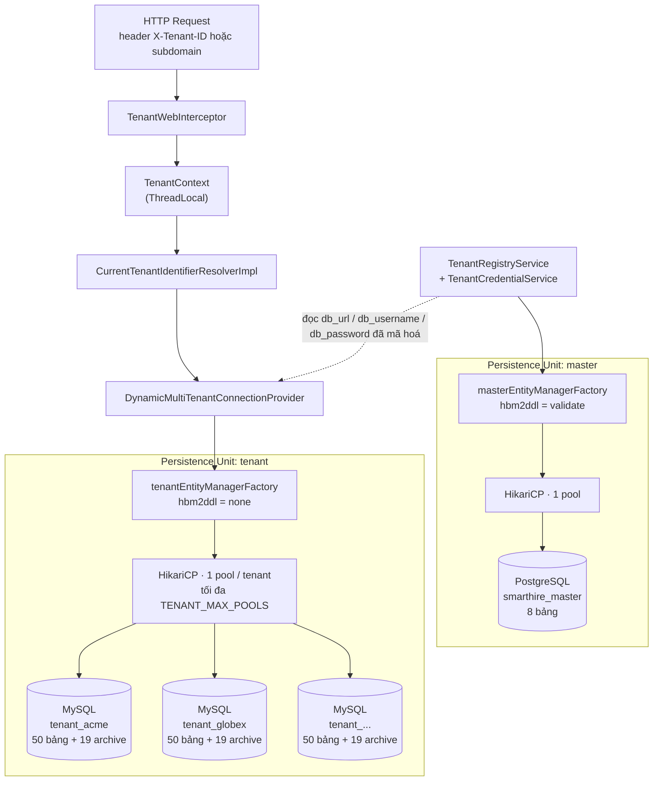

### 1.2 Hai persistence unit tách rời

| Hạng mục | Master | Tenant |
|---|---|---|
| Cấu hình | `config/MasterJpaConfig.java` | `config/MultiTenantJpaConfig.java` |
| Package entity quét | `com.smarthire.domain.master` | `com.smarthire.domain.tenant` |
| EntityManagerFactory | `masterEntityManagerFactory` | `tenantEntityManagerFactory` (`@Primary`) |
| TransactionManager | `masterTransactionManager` | `tenantTransactionManager` (`@Primary`) |
| RDBMS | PostgreSQL | MySQL |
| `hibernate.hbm2ddl.auto` | `validate` | `none` |
| Naming strategy | `CamelCaseToUnderscoresNamingStrategy` | Tên cột khai báo tường minh trong entity |
| DataSource | Một HikariCP cố định | `DynamicMultiTenantConnectionProvider` cấp pool theo tenant |
| Kiểu thời gian trong entity | `LocalDateTime` | `Instant` |
| Kiểu khoá ngoại trong entity | `Long` thô (không có association) | `@ManyToOne(fetch = LAZY)` |

> Giá trị `spring.jpa.hibernate.ddl-auto: auto` trong `application.yml` là giá trị **không hợp lệ** nhưng
> vô hại, vì cả hai `EntityManagerFactory` đều ghi đè nó bằng `validate` và `none`.

### 1.3 Cơ chế fail-closed khi thiếu ngữ cảnh tenant

`CurrentTenantIdentifierResolverImpl` trả về sentinel `__no_tenant__` khi `TenantContext` rỗng, blank, hoặc
bằng `smarthire_master`. Sentinel này không ứng với datasource nào nên registry từ chối trước khi có bất kỳ
truy cập JDBC nào. Hệ quả: một request hoặc một `@RabbitListener` quên set `TenantContext` sẽ **hỏng ngay**,
thay vì âm thầm đọc nhầm database của doanh nghiệp khác.

---

## 2. Database List

| # | Database | RDBMS | Số bảng | Instance | Phạm vi dữ liệu | Migration path |
|---|---|---|---|---|---|---|
| 01 | `smarthire_master` | PostgreSQL | 8 | Duy nhất toàn nền tảng | Doanh nghiệp, gói cước, hoá đơn, usage, quản trị nền tảng | `db/migration/master` |
| 02 | `<db_name> theo từng tenant` | MySQL | 48 + 19 archive | N instance, mỗi doanh nghiệp một database | Toàn bộ nghiệp vụ tuyển dụng của một doanh nghiệp | `db/migration/tenant` |

**Cấu hình kết nối** (`application.yml`, không commit giá trị thật):

| Thuộc tính | Biến môi trường | Mặc định |
|---|---|---|
| Master URL | `MASTER_DB_URL` | `jdbc:postgresql://localhost:5432/smarthire_master` |
| Master pool | `MASTER_DB_POOL_SIZE` | `10` |
| Tenant base URL | `TENANT_MYSQL_BASE_URL` | `jdbc:mysql://localhost:3306` |
| Tenant pool size | `TENANT_DB_POOL_SIZE` | `5` |
| Số pool tenant tối đa | `TENANT_MAX_POOLS` | `20` |
| Khoá mã hoá credential | `TENANT_CREDENTIALS_KEY` | bắt buộc, không mặc định |
| Tài khoản provisioning | `TENANT_PROVISIONING_USERNAME` | `smarthire_provisioner` |

---

## 3. Entity List

### 3.1 Master — 8 entity (`com.smarthire.domain.master.entity`)

| No | Entity | Bảng | Nhóm | Ghi chú |
|---|---|---|---|---|
| 01 | `TenantInfo` | `tenants` | Tenant | Gốc của Master DB |
| 02 | `SubscriptionPlan` | `subscription_plans` | Subscription | Bảng tra cứu gói + hạn mức |
| 03 | `TenantSubscription` | `tenant_subscriptions` | Subscription | Gói đang áp dụng cho tenant |
| 04 | `Invoice` | `invoices` | Billing | Hoá đơn |
| 05 | `TenantUsageDaily` | `tenant_usage_daily` | Analytics | Usage tổng hợp theo ngày |
| 06 | `PlatformUser` | `platform_users` | Admin | Tài khoản quản trị nền tảng |
| 07 | `PlatformAuditLog` | `platform_audit_logs` | Audit | Nhật ký cấp nền tảng |
| 08 | `ConsultationRequest` | `consultation_requests` | Sales | Yêu cầu demo/tư vấn từ landing |

### 3.2 Tenant — 51 entity (`com.smarthire.domain.tenant.entity`)

| No | Entity | Bảng | Nhóm nghiệp vụ | Kế thừa `BaseEntity` |
|---|---|---|---|---|
| 01 | `User` | `users` | Identity | Có |
| 02 | `UserProfile` | `user_profiles` | Identity | Có |
| 03 | `OauthAccount` | `oauth_accounts` | Identity | Không |
| 04 | `MemberInvitation` | `member_invitations` | Identity | Có |
| 05 | `Job` | `jobs` | Job & Skill | Có |
| 06 | `Skill` | `skills` | Job & Skill | Không |
| 07 | `JobSkill` | `job_skills` | Job & Skill | Không |
| 08 | `RecruitmentStage` | `recruitment_stages` | Job & Skill | Không |
| 09 | `Application` | `applications` | Application pipeline | Có |
| 10 | `ApplicationStatusHistory` | `application_status_history` | Application pipeline | Không |
| 11 | `HiringDecision` | `hiring_decisions` | Application pipeline | Không |
| 12 | `InterviewSchedule` | `interview_schedules` | Direct Interview | Không |
| 13 | `Cv` | `cvs` | CV & AI screening | Có |
| 14 | `CvDocument` | `cv_documents` | CV & AI screening | Không |
| 15 | `CvExtraction` | `cv_extractions` | CV & AI screening | Không |
| 16 | `CvAnalysis` | `cv_analyses` | CV & AI screening | Không |
| 17 | `CvSkill` | `cv_skills` | CV & AI screening | Không |
| 18 | `MatchScore` | `match_scores` | CV & AI screening | Không |
| 19 | `OverallScore` | `overall_scores` | Ranking | Không |
| 20 | `CandidateRanking` | `candidate_rankings` | Ranking | Không |
| 21 | `RankingConfig` | `ranking_configs` | Ranking | Không — PK tự nhiên `job_id` |
| 22 | `RankingSource` | `ranking_sources` | Ranking | Không — PK tự nhiên `application_id` |
| 23 | `Recommendation` | `recommendations` | Ranking | Không |
| 24 | `JobTest` | `tests` | Test & Proctoring | Không |
| 25 | `Question` | `questions` | Test & Proctoring | Không |
| 26 | `Option` | `options` | Test & Proctoring | Không |
| 27 | `CodingProblem` | `coding_problems` | Test & Proctoring | Không |
| 28 | `TestCase` | `test_cases` | Test & Proctoring | Không |
| 29 | `Submission` | `submissions` | Test & Proctoring | Không |
| 30 | `Answer` | `answers` | Test & Proctoring | Không |
| 31 | `CodingSubmission` | `coding_submissions` | Test & Proctoring | Không |
| 32 | `ProctorEvent` | `proctor_events` | Test & Proctoring | Không |
| 33 | `ProctorReport` | `proctor_reports` | Test & Proctoring | Không |
| 34 | `Interview` | `interviews` | Direct Interview | Có |
| 35 | `InterviewParticipant` | `interview_participants` | Direct Interview | Không — PK kép |
| 36 | `InterviewSecuritySetting` | `interview_security_settings` | Direct Interview | Có |
| 37 | `InterviewEvaluation` | `interview_evaluations` | Direct Interview | Không |
| 38 | `AiInterview` | `ai_interviews` | AI Interview | Không |
| 39 | `AiQuestion` | `ai_questions` | AI Interview | Không |
| 40 | `AiAnswer` | `ai_answers` | AI Interview | Không |
| 41 | `AiFeedback` | `ai_feedbacks` | AI Interview | Không |
| 42 | `Notification` | `notifications` | Notification | Không |
| 43 | `EmailOutbox` | `email_outbox` | Notification | Không |
| 44 | `PracticeSession` | `practice_sessions` | Practice | Không |
| 45 | `PracticeAnswer` | `practice_answers` | Practice | Không |
| 46 | `PracticeFeedback` | `practice_feedbacks` | Practice | Không |
| 47 | `RolePermission` | `role_permissions` | Identity | Có |
| 48 | `TenantRole` | `roles` | Identity | Có |
| 49 | `JobScreeningConfig` | `job_screening_configs` | CV & AI screening | Không — PK tự nhiên `job_id` |
| 50 | `GateScore` | `gate_scores` | CV & AI screening | Có |
| 51 | `LandingPageSetting` | `landing_page_settings` | Branding | Có |

**Bảng lưu trữ V12 (19 bảng, không có entity):** thêm tiền tố `legacy_v12_` vào các tên
`assessments`, `questions`, `question_options`, `attempts`, `attempt_answers`, `attempt_scores`,
`coding_problems`, `test_cases`, `coding_submissions`, `proctor_events`, `proctor_reports`,
`interviews`, `interview_questions`, `interview_answers`, `interview_answer_analyses`,
`interview_scores`, `interview_feedbacks`, `interview_schedules`, `practice_feedbacks`.
Chúng giữ dữ liệu/schema cột trước redesign; không tự chuyển lịch sử sang model hiện hành.
Không xóa archive trước khi có kế hoạch chuyển đổi và sao lưu được duyệt.

`BaseEntity` (`@MappedSuperclass`, không sinh bảng) cung cấp `id`, `created_at`, `updated_at` cùng callback
`@PrePersist` / `@PreUpdate`. Các entity không kế thừa nó tự khai báo `@Id` và chỉ có `created_at`.

### 3.3 Enum dùng cho cột trạng thái (`com.smarthire.domain.enums`)

| Enum | Bảng · cột sử dụng | Giá trị |
|---|---|---|
| `UserRole` | `users.role` | `TENANT_ADMIN`, `ADMIN`, `HR`, `RECRUITER`, `CANDIDATE` |
| `UserStatus` | `users.status` | `ACTIVE`, `LOCKED`, `DISABLED` |
| `OAuthProvider` | `oauth_accounts.provider` | `GOOGLE` |
| `InvitationStatus` | `member_invitations.status` | `PENDING`, `ACCEPTED` |
| `JobStatus` | `jobs.status` | `DRAFT`, `PUBLISHED`, `PAUSED`, `CLOSED`, `ARCHIVED` |
| `ApplicationStatus` | `applications.status` | `NEW`, `IN_REVIEW`, `ASSESSMENT`, `INTERVIEW`, `OFFER`, `HIRED`, `REJECTED`, `WITHDRAWN` |
| `HiringDecisionType` | `hiring_decisions.decision` | `HIRE`, `REJECT`, `HOLD` |
| `CvStatus` | `cvs.status` | `UPLOADED`, `PARSING`, `PARSED`, `EXTRACTING`, `ANALYZING`, `ANALYZED`, `FAILED` |
| `TestStatus` | `tests.status` | `DRAFT`, `PUBLISHED`, `ARCHIVED` |
| `TestSubmissionStatus` | `submissions.status` | `NOT_STARTED`, `IN_PROGRESS`, `SUBMITTED`, `GRADED`, `EXPIRED` |
| `SubmissionStatus` | `coding_submissions.status` | `QUEUED`, `RUNNING`, `PASSED`, … |
| `InterviewStatus` | `interviews.status` | `CREATED`, `SCHEDULED`, `IN_PROGRESS`, `EVALUATED`, `CANCELLED` |
| `AiInterviewStatus` | `ai_interviews.status` | `CREATED`, `QUESTIONS_READY`, `IN_PROGRESS`, `SCORING`, `SCORED`, `FAILED` |
| `ScheduleStatus` | `interview_schedules.status` | `PROPOSED`, `CONFIRMED`, `CANCELLED`, `DONE` |
| `PracticeStatus` | `practice_sessions.status` | `CREATED`, `IN_PROGRESS`, `COMPLETED`, `FAILED` |
| `NotificationStatus` | **chưa dùng** | `PENDING`, `SENT`, `FAILED` |

Tất cả đều lưu dưới dạng `VARCHAR(32)` với `@Enumerated(EnumType.STRING)`. Database **không** có `CHECK`
constraint, nên miền giá trị chỉ được ứng dụng bảo đảm.

---

## 4. ERD

Các sơ đồ dưới đây chỉ thể hiện **quan hệ và lực lượng (cardinality)**. Danh sách cột đầy đủ nằm ở
[mục 6](#6-table-specification--data-dictionary).

Quy ước Mermaid: `||` đúng một · `o|` không hoặc một · `o{` không hoặc nhiều · `|{` một hoặc nhiều.

### 4.1 Master DB — PostgreSQL

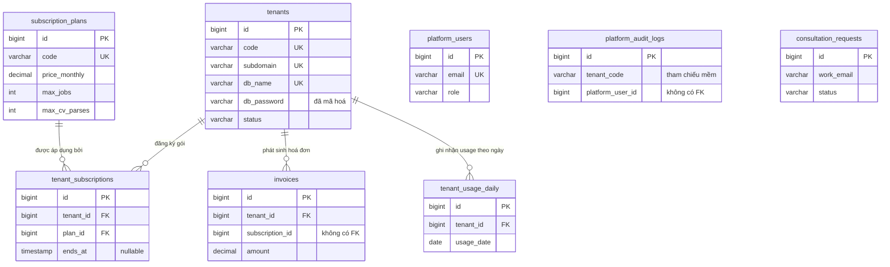

`platform_users`, `platform_audit_logs` và `consultation_requests` **không** có khoá ngoại nào — đây là lựa
chọn cố ý để log và lead sống lâu hơn vòng đời của tenant.

### 4.2 Tenant DB — bản đồ tổng quan theo nhóm nghiệp vụ

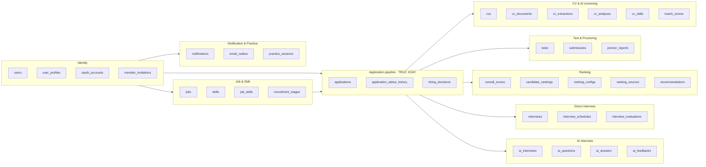

### 4.3 Tenant — Identity & Access

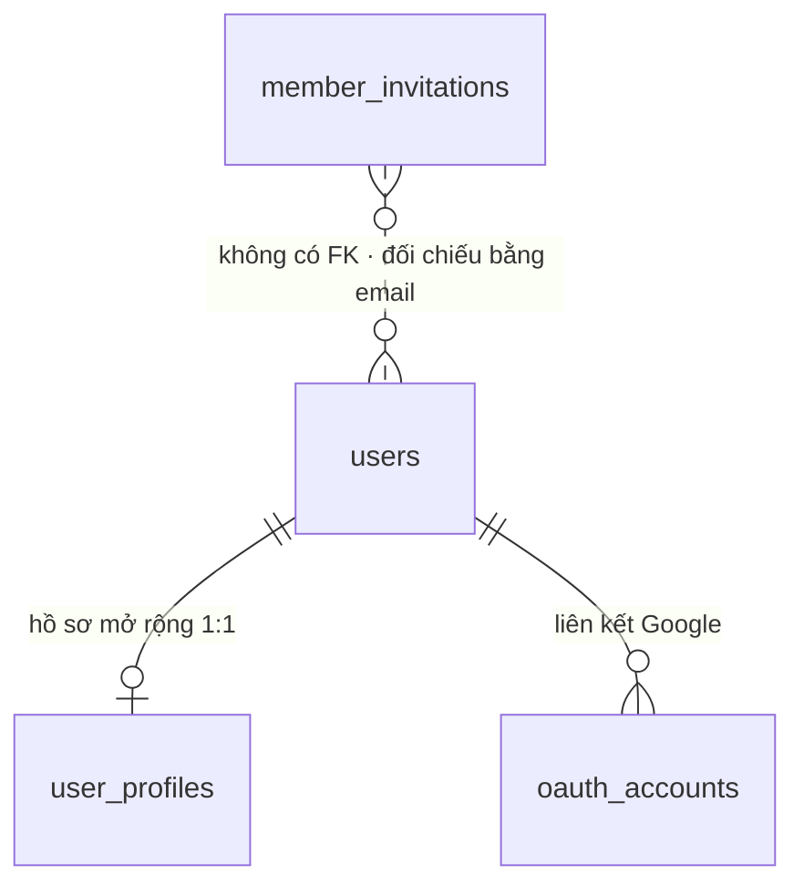

### 4.4 Tenant — Job, Skill & Application pipeline (lõi)

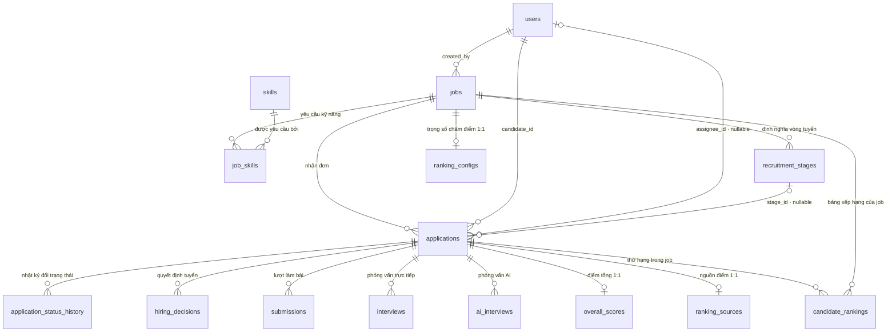

### 4.5 Tenant — CV & AI screening

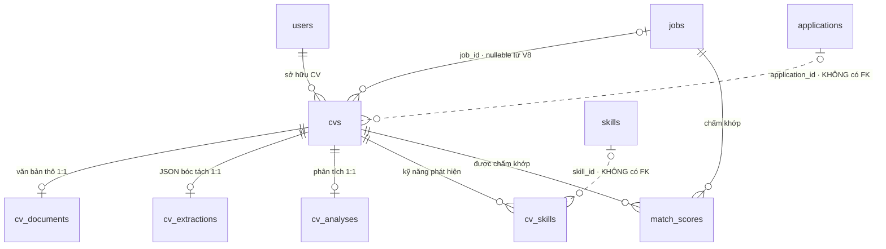

Pipeline chạy tuần tự qua RabbitMQ: `cv.parse` ghi `cv_documents` → `cv.extract` ghi `cv_extractions` →
`cv.analysis` ghi `cv_analyses` và `cv_skills` → `cv.matching` ghi `match_scores`. Cột `cvs.status` phản
ánh chặng hiện tại.

### 4.6 Tenant — Test & Proctoring

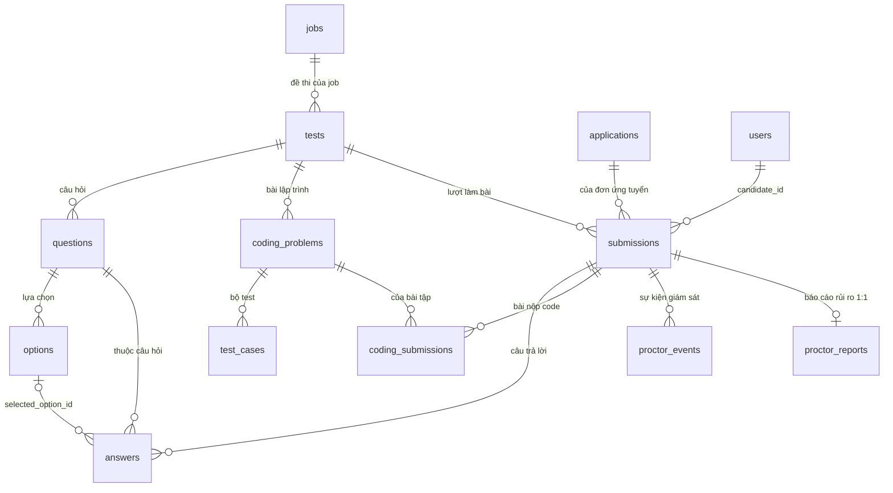

### 4.7 Tenant — Direct Interview

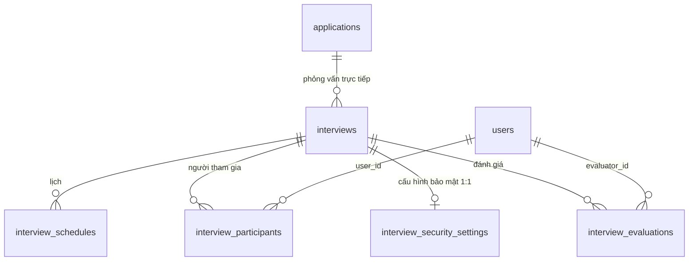

### 4.8 Tenant — AI Interview

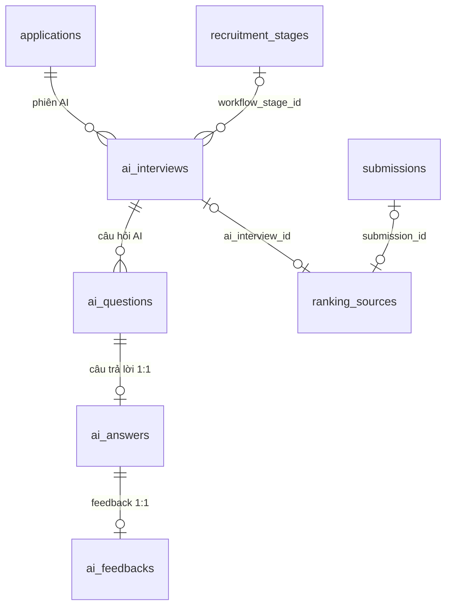

### 4.9 Tenant — Notification & Practice

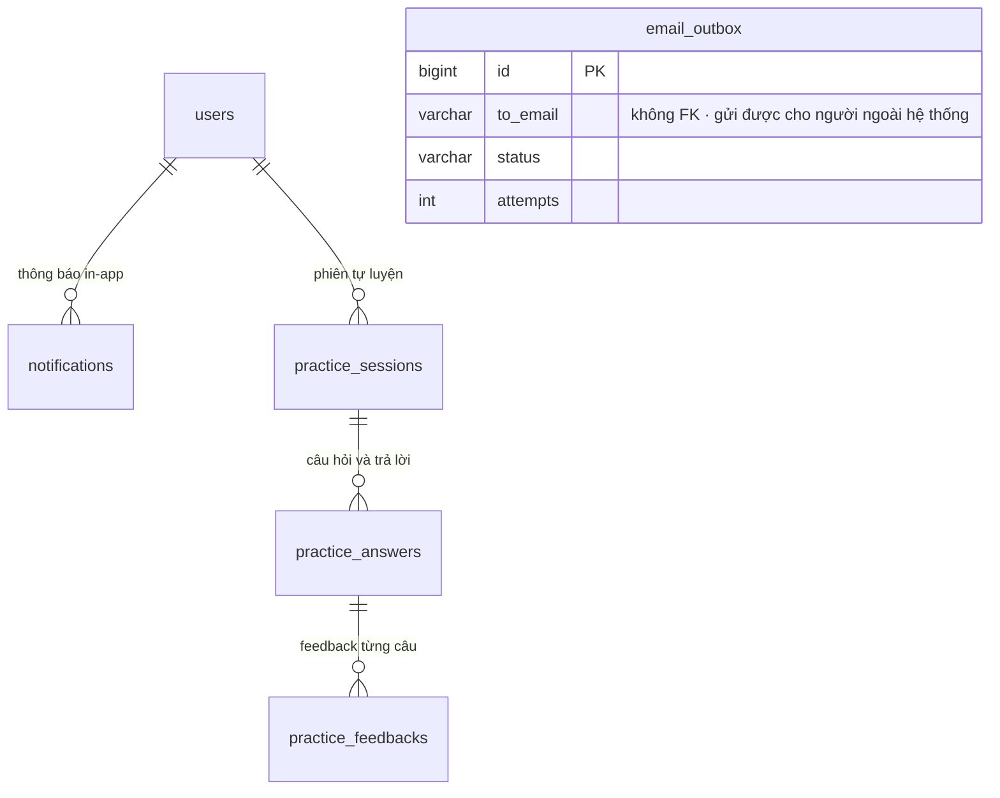

---

### 4.10 Archive V12

ERD phía trên mô tả model hiện hành. Các FK còn tồn tại trong archive được đối chiếu từ SQL/MySQL:

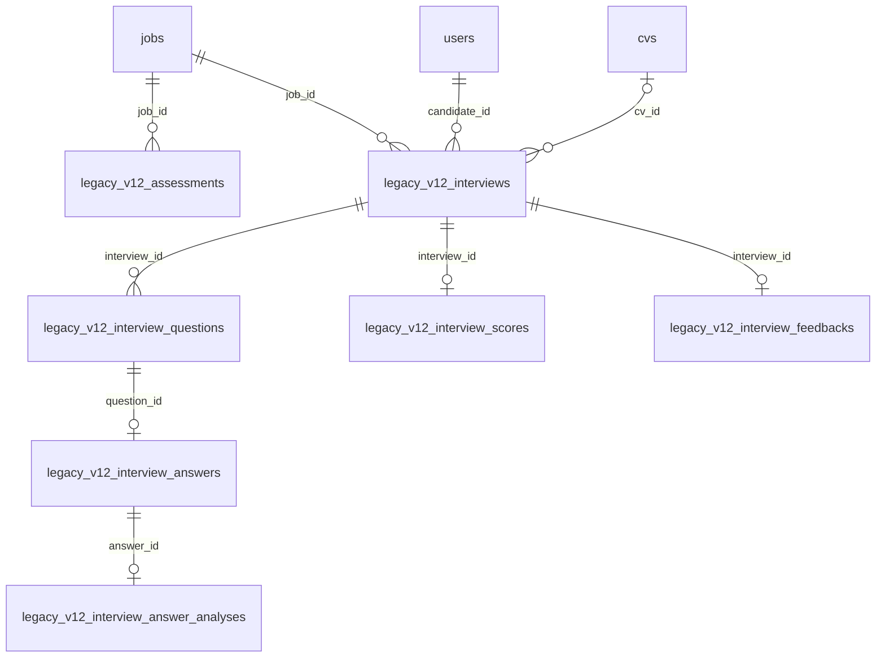

Các archive khác trong §3.2 không còn FK sau V12; cột ID vẫn giữ nguyên giá trị, không suy ra
ràng buộc FK từ tên cột. `ranking_sources.legacy_attempt_id/legacy_interview_id` là tham chiếu mềm
đến archive; không vẽ chúng thành quan hệ được database bảo vệ.

## 5. Entity Description

### 5.1 Master

| Entity | Mục đích | Thuộc tính then chốt | Vòng đời |
|---|---|---|---|
| `TenantInfo` | Đại diện một doanh nghiệp khách hàng và cách kết nối tới database riêng của họ | `code`, `subdomain`, `db_name`, `db_url`, `db_username`, `db_password` (mã hoá, `@JsonIgnore`), `managed_database`, hồ sơ công ty, `is_verified` | Tạo khi onboarding → `ACTIVE` → có thể khoá/xoá |
| `SubscriptionPlan` | Định nghĩa gói dịch vụ và hạn mức tiêu thụ | `price_monthly`, `price_yearly`, `max_jobs`, `max_cv_parses`, `max_ai_interview_hours`, `max_storage_gb`, `max_proctoring_hours`, `video_retention_days`, `features_json` | Bảng tra cứu, ít thay đổi |
| `TenantSubscription` | Gói mà một tenant đang dùng trong một khoảng thời gian | `tenant_id`, `plan_id`, `starts_at`, `ends_at`, `auto_renew` | `ACTIVE` → hết hạn hoặc gia hạn |
| `Invoice` | Hoá đơn phát sinh cho tenant | `amount`, `currency`, `payment_gateway`, `transaction_id`, `paid_at` | `PENDING` → thanh toán |
| `TenantUsageDaily` | Số liệu tiêu thụ theo ngày để đối chiếu hạn mức | `usage_date`, `cv_parses_count`, `ai_voice_seconds`, `proctoring_seconds`, `storage_bytes`, `active_jobs_count`, `ai_tokens_consumed` | Một dòng/tenant/ngày, cập nhật tăng dần |
| `PlatformUser` | Tài khoản quản trị nền tảng, tách hoàn toàn khỏi `users` của tenant | `email`, `password_hash`, `role` (mặc định `WORKSPACE_ADMIN`) | `ACTIVE` / khoá |
| `PlatformAuditLog` | Nhật ký hành động cấp nền tảng | `tenant_code`, `action`, `level`, `ip_address`, `metadata_json` | Chỉ ghi thêm, không sửa |
| `ConsultationRequest` | Lead demo/tư vấn gửi từ landing page | `company_name`, `work_email`, `request_type`, `plan_tier`, `primary_need` | `PENDING` → xử lý |

### 5.2 Tenant — Identity & Access

| Entity | Mục đích | Ghi chú quan trọng |
|---|---|---|
| `User` | Mọi loại người dùng của một doanh nghiệp nằm chung một bảng, phân biệt bằng `role` | Không có bảng riêng cho recruiter hay ứng viên. `email` unique trong phạm vi tenant. `password_hash` nullable để hỗ trợ tài khoản chỉ đăng nhập OAuth |
| `UserProfile` | Thông tin mở rộng: điện thoại, avatar, bio, headline, `links_json` | 1:1 với `users` |
| `OauthAccount` | Liên kết tài khoản Google | Unique theo `(provider, provider_user_id)` |
| `MemberInvitation` | Lời mời nhân sự vào workspace | Lưu `token_hash` chứ **không** lưu token gốc. Không có FK tới `users`; đối chiếu bằng email khi chấp nhận |
| `RolePermission` | Quyền truy cập tính năng của role | UNIQUE `(role, feature_code)`; không có FK đến roles |
| `TenantRole` | Role hệ thống và tùy chỉnh | UNIQUE `code`; workspace phân vùng giao diện |

Các bảng `legacy_v12_*` không có entity/service mới: chỉ lưu dữ liệu trước nâng cấp để kiểm tra
và chuyển đổi có chủ đích. Không phải nguồn dữ liệu của màn assessment hiện tại.

### 5.3 Tenant — Job & Skill

| Entity | Mục đích | Ghi chú quan trọng |
|---|---|---|
| `Job` | Tin tuyển dụng đầy đủ: mô tả, trách nhiệm, phúc lợi, dải lương, headcount, deadline, `work_mode`, học vấn tối thiểu | Vòng đời `DRAFT → PUBLISHED → PAUSED → CLOSED → ARCHIVED`, có `published_at`, `paused_at`, `closed_at` và `deleted_at` để xoá mềm. `salary_visible` điều khiển hiển thị lương ra trang tuyển dụng công khai |
| `Skill` | Từ điển kỹ năng dùng chung trong một tenant | `aliases_json` gom các biến thể tên về một chuẩn |
| `JobSkill` | Kỹ năng mà job yêu cầu | Bảng nối N-N, mang thêm `weight`, `required`, `min_level` để phục vụ chấm điểm khớp |
| `RecruitmentStage` | Các vòng tuyển do recruiter tự định nghĩa cho từng job | `sort_order` quyết định thứ tự, `is_terminal` đánh dấu vòng kết thúc |

### 5.4 Tenant — Application pipeline

| Entity | Mục đích | Ghi chú quan trọng |
|---|---|---|
| `Application` | **Bảng trung tâm của toàn bộ tenant schema.** Một ứng viên nộp vào một job | Test submission, lịch phỏng vấn, AI interview, điểm tổng và thứ hạng đều neo vào đây. Mang `status`, `stage_id`, `assignee_id`, `tags`, `referral_code`, `reject_reason`, `withdrawn_at`, `archived_at`, `ai_interview_invited_at` (V14) |
| `ApplicationStatusHistory` | Nhật ký mỗi lần đổi trạng thái | `from_status → to_status`, `changed_by`, `note`. `changed_by` là số thô, không có FK |
| `HiringDecision` | Quyết định cuối cùng của đơn | `HIRE` / `REJECT` / `HOLD` kèm `reason`. `decided_by` không có FK |

### 5.5 Tenant — CV & AI screening

| Entity | Mục đích | Ghi chú quan trọng |
|---|---|---|
| `Cv` | File CV và trạng thái pipeline | `storage_key`, `mime_type`, `file_size`, `checksum_sha256` (chống trùng file), `retain_until` (vòng đời lưu trữ), `error_code` / `error_message` khi pipeline hỏng. Có method `mark()` và `fail()` để chuyển trạng thái an toàn |
| `CvDocument` | Chặng 1 — văn bản thô bóc từ file | `raw_text` kiểu `LONGTEXT`, `page_count`, `ocr_used`, `parser_version` |
| `CvExtraction` | Chặng 2 — JSON có cấu trúc do AI bóc tách | `extraction_json`, `model_version`, `prompt_version` |
| `CvAnalysis` | Chặng 3 — tóm tắt và đánh giá | `summary`, `years_experience`, `skills_json`, `raw_json`, `model_version`, `prompt_version` |
| `CvSkill` | Kỹ năng phát hiện trong CV | `skill_id` nullable và **không có FK** — để trống khi chưa map được vào từ điển `skills`; `skill_name` luôn được ghi |
| `MatchScore` | Điểm khớp giữa một job và một CV | Unique `(job_id, cv_id)`, có `breakdown_json` và `model_version` |

### 5.6 Tenant — Ranking

| Entity | Mục đích | Ghi chú quan trọng |
|---|---|---|
| `OverallScore` | Điểm tổng hợp cuối cùng của một đơn | 1:1 với `applications`, có `ranking_version` |
| `CandidateRanking` | Thứ hạng cụ thể của đơn trong một job | Unique `(job_id, application_id)`, mang `rank_position` |
| `RankingConfig` | Bộ trọng số chấm điểm cấu hình riêng cho từng job | **PK tự nhiên `job_id`** để ép 1:1. `config_json` + `revision` cho phép version hoá cấu hình |
| `RankingSource` | Chốt ba nguồn điểm đã dùng để tính hạng | **PK tự nhiên `application_id`**. Ba cột `cv_id`, `submission_id`, `ai_interview_id` đều nullable và **đều có FK** |
| `Recommendation` | Gợi ý dạng đa hình | `subject_type`/`subject_id` → `target_type`/`target_id`. Không có FK nào; toàn vẹn phụ thuộc hoàn toàn vào code |

### 5.7 Tenant — Test & Proctoring

| Entity | Mục đích | Ghi chú quan trọng |
|---|---|---|
| `JobTest` | Đề thi gắn với một job (bảng `tests`) | `duration_minutes`, `passing_score`, `status` — tên class tránh xung đột JUnit `Test` |
| `Question` | Câu hỏi trắc nghiệm hoặc tự luận | `question_text`, `question_type`, `points`, `question_order` |
| `Option` | Lựa chọn trả lời | `is_correct` — **không được trả cột này ra API cho thí sinh** |
| `CodingProblem` | Bài lập trình | `time_limit_ms`, `memory_mb`, FK `test_id` |
| `TestCase` | Bộ test của bài code | `is_sample`, `weight` |
| `Submission` | Một lượt làm bài của ứng viên | Điểm tổng nằm ở cột `score`; cho phép làm lại nhiều lần |
| `Answer` | Câu trả lời trong lượt làm | `selected_option_id` (có FK), `answer_text`, `is_correct`, `score` |
| `CodingSubmission` | Bài nộp code | `language`, `source_code`, `result_json`, `status` |
| `ProctorEvent` | Sự kiện giám sát thô | FK `submission_id` |
| `ProctorReport` | Báo cáo rủi ro tổng hợp | 1:1 với `submissions` |

### 5.8 Tenant — Direct Interview

| Entity | Mục đích | Ghi chú quan trọng |
|---|---|---|
| `Interview` | Phiên phỏng vấn trực tiếp (người) | Neo vào `applications`; `interview_type`, `mode`, `status` |
| `InterviewSchedule` | Lịch của phiên | `scheduled_start` / `scheduled_end`, `location`, `meeting_url` |
| `InterviewParticipant` | Người tham gia | PK kép `(interview_id, user_id)`, `participant_role` |
| `InterviewSecuritySetting` | Cấu hình camera/mic/fullscreen… | 1:1 với `interviews` |
| `InterviewEvaluation` | Đánh giá của interviewer | Điểm technical/communication/culture/overall + `recommendation` |

### 5.9 Tenant — AI Interview

| Entity | Mục đích | Ghi chú quan trọng |
|---|---|---|
| `AiInterview` | Phiên phỏng vấn AI | Neo vào `applications`, tùy chọn `workflow_stage_id`; `overall_score` trên phiên |
| `AiQuestion` | Câu hỏi do AI sinh | `question_order`, `question_type` |
| `AiAnswer` | Câu trả lời ứng viên | 1:1 với `ai_questions`; `answer_duration`, `answered_at` |
| `AiFeedback` | Feedback AI theo từng câu trả lời | 1:1 với `ai_answers`; `score`, `strengths`, `weaknesses` |

### 5.10 Tenant — Notification & Practice

| Entity | Mục đích | Ghi chú quan trọng |
|---|---|---|
| `Notification` | Thông báo in-app | `type`, `payload_json`, `read_at`. Bảng **không** dùng enum `NotificationStatus` |
| `EmailOutbox` | Hàng đợi email theo mẫu outbox | Không có FK — cố ý. `attempts` đếm số lần thử |
| `PracticeSession` | Phiên tự luyện | Tách khỏi ranking; có `started_at`, `completed_at`, `overall_score` |
| `PracticeAnswer` | Câu hỏi/trả lời trong phiên | Có thể kèm `audio_url`, `answer_duration` |
| `PracticeFeedback` | Feedback theo từng câu trả lời | FK `practice_answer_id`; `strengths` / `weaknesses` |

---

## 6. Table Specification / Data Dictionary

Đặc tả cột đầy đủ (tên cột, kiểu, độ dài, nullable, default, khoá, mô tả) được tách sang hai file riêng
để tài liệu này giữ được độ đọc:

| File | Phạm vi | Số bảng |
|---|---|---|
| [`DATA_DICTIONARY_MASTER.md`](DATA_DICTIONARY_MASTER.md) | PostgreSQL `smarthire_master` | 8 |
| [`DATA_DICTIONARY_TENANT.md`](DATA_DICTIONARY_TENANT.md) | MySQL — schema mỗi tenant | 48 + 19 archive |

### Quy ước ký hiệu dùng chung

| Ký hiệu | Ý nghĩa |
|---|---|
| `PK` | Primary key |
| `FK` | Foreign key **đã khai báo trong SQL** |
| `UQ` | Thuộc một ràng buộc UNIQUE |
| `IDX` | Thuộc một index thường |
| `?` | Cho phép `NULL` |
| `ref*` | Cột trông như khoá ngoại nhưng **không** có ràng buộc trong database |

### Quy ước đặt tên

| Đối tượng | Quy ước | Ví dụ |
|---|---|---|
| Bảng | `snake_case`, số nhiều | `interview_answers` |
| Cột | `snake_case` | `checksum_sha256` |
| Khoá chính | `id` (trừ `ranking_configs`, `ranking_sources` dùng PK tự nhiên) | `id` |
| Khoá ngoại | `<đối_tượng>_id` | `application_id` |
| Cột JSON | hậu tố `_json` | `breakdown_json` |
| Cột thời điểm | hậu tố `_at` | `published_at` |
| Ràng buộc FK | `fk_<viết_tắt_bảng>_<đích>` | `fk_app_candidate` |
| Ràng buộc UNIQUE | `uk_<viết_tắt_bảng>_<cột>` | `uk_app_job_candidate` |
| Index | `idx_<bảng>_<cột>` | `idx_app_job_status` |

`@Table(name = ...)` trong entity **bắt buộc** viết thường, khớp đúng tên bảng Flyway.

---

## 7. Relationships

### 7.1 Master — 4 khoá ngoại

| Bảng con | Cột | Bảng cha | Nullable | Lực lượng | Tên ràng buộc |
|---|---|---|---|---|---|
| `tenant_subscriptions` | `tenant_id` | `tenants` | Không | N:1 | `fk_ts_tenant` |
| `tenant_subscriptions` | `plan_id` | `subscription_plans` | Không | N:1 | `fk_ts_plan` |
| `invoices` | `tenant_id` | `tenants` | Không | N:1 | `fk_inv_tenant` |
| `tenant_usage_daily` | `tenant_id` | `tenants` | Không | N:1 (1:1 theo ngày) | `fk_tud_tenant` |

### 7.2 Tenant — 59 khoá ngoại hiện hành

| Bảng con | Cột | Bảng cha | Nullable | Lực lượng | Tên ràng buộc |
|---|---|---|---|---|---|
| `oauth_accounts` | `user_id` | `users` | Không | N:1 | `fk_oauth_user` |
| `user_profiles` | `user_id` | `users` | Không | 1:1 (UQ) | `fk_profile_user` |
| `jobs` | `created_by` | `users` | Không | N:1 | `fk_jobs_user` |
| `job_skills` | `job_id` | `jobs` | Không | N:1 | `fk_js_job` |
| `job_skills` | `skill_id` | `skills` | Không | N:1 | `fk_js_skill` |
| `recruitment_stages` | `job_id` | `jobs` | Không | N:1 | `fk_rs_job` |
| `applications` | `job_id` | `jobs` | Không | N:1 | `fk_app_job` |
| `applications` | `candidate_id` | `users` | Không | N:1 | `fk_app_candidate` |
| `applications` | `stage_id` | `recruitment_stages` | Có | N:0..1 | `fk_app_stage` |
| `applications` | `assignee_id` | `users` | Có | N:0..1 | `fk_app_assignee` |
| `application_status_history` | `application_id` | `applications` | Không | N:1 | `fk_ash_app` |
| `hiring_decisions` | `application_id` | `applications` | Không | N:1 | `fk_hd_app` |
| `cvs` | `job_id` | `jobs` | Có (từ V8) | N:0..1 | `fk_cvs_job` |
| `cvs` | `user_id` | `users` | Không | N:1 | `fk_cvs_user` |
| `cv_documents` | `cv_id` | `cvs` | Không | 1:1 (UQ) | `fk_cvdoc_cv` |
| `cv_extractions` | `cv_id` | `cvs` | Không | 1:1 (UQ) | `fk_cvext_cv` |
| `cv_analyses` | `cv_id` | `cvs` | Không | 1:1 (UQ) | `fk_cv_analyses_cv` |
| `cv_skills` | `cv_id` | `cvs` | Không | N:1 | `fk_cvsk_cv` |
| `match_scores` | `job_id` | `jobs` | Không | N:1 | `fk_match_job` |
| `match_scores` | `cv_id` | `cvs` | Không | N:1 | `fk_match_cv` |
| `overall_scores` | `application_id` | `applications` | Không | 1:1 (UQ) | `fk_os_app` |
| `candidate_rankings` | `job_id` | `jobs` | Không | N:1 | `fk_cr_job` |
| `candidate_rankings` | `application_id` | `applications` | Không | N:1 (UQ cặp) | `fk_cr_app` |
| `ranking_configs` | `job_id` | `jobs` | Không | 1:1 (PK) | `fk_rank_config_job` |
| `ranking_sources` | `application_id` | `applications` | Không | 1:1 (PK) | `fk_rank_source_app` |
| `ranking_sources` | `cv_id` | `cvs` | Có | 1:0..1 | `fk_rank_source_cv` |
| `ranking_sources` | `submission_id` | `submissions` | Có | 1:0..1 | `fk_rank_source_submission` |
| `ranking_sources` | `ai_interview_id` | `ai_interviews` | Có | 1:0..1 | `fk_rank_source_ai_interview` |
| `tests` | `job_id` | `jobs` | Không | N:1 | `fk_tests_job` |
| `questions` | `test_id` | `tests` | Không | N:1 | `fk_questions_test` |
| `options` | `question_id` | `questions` | Không | N:1 | `fk_options_question` |
| `coding_problems` | `test_id` | `tests` | Không | N:1 | `fk_cp_test` |
| `test_cases` | `coding_problem_id` | `coding_problems` | Không | N:1 | `fk_tc_cp` |
| `submissions` | `test_id` | `tests` | Không | N:1 | `fk_submissions_test` |
| `submissions` | `candidate_id` | `users` | Không | N:1 | `fk_submissions_candidate` |
| `submissions` | `application_id` | `applications` | Không | N:1 | `fk_submissions_application` |
| `answers` | `submission_id` | `submissions` | Không | N:1 | `fk_answers_submission` |
| `answers` | `question_id` | `questions` | Không | N:1 | `fk_answers_question` |
| `answers` | `selected_option_id` | `options` | Có | N:0..1 | `fk_answers_option` |
| `coding_submissions` | `submission_id` | `submissions` | Không | N:1 | `fk_cs_submission` |
| `coding_submissions` | `coding_problem_id` | `coding_problems` | Không | N:1 | `fk_cs_cp` |
| `proctor_events` | `submission_id` | `submissions` | Không | N:1 | `fk_pe_submission` |
| `proctor_reports` | `submission_id` | `submissions` | Không | 1:1 (UQ) | `fk_pr_submission` |
| `interviews` | `application_id` | `applications` | Không | N:1 | `fk_interviews_application` |
| `interview_schedules` | `interview_id` | `interviews` | Không | N:1 | `fk_isched_interview` |
| `interview_participants` | `interview_id` | `interviews` | Không | N:1 | `fk_ip_interview` |
| `interview_participants` | `user_id` | `users` | Không | N:1 | `fk_ip_user` |
| `interview_security_settings` | `interview_id` | `interviews` | Không | 1:1 (UQ) | `fk_iss_interview` |
| `interview_evaluations` | `interview_id` | `interviews` | Không | N:1 | `fk_ie_interview` |
| `interview_evaluations` | `evaluator_id` | `users` | Không | N:1 | `fk_ie_evaluator` |
| `ai_interviews` | `application_id` | `applications` | Không | N:1 | `fk_ai_int_application` |
| `ai_interviews` | `workflow_stage_id` | `recruitment_stages` | Có | N:0..1 | `fk_ai_int_stage` |
| `ai_questions` | `ai_interview_id` | `ai_interviews` | Không | N:1 | `fk_ai_q_interview` |
| `ai_answers` | `ai_question_id` | `ai_questions` | Không | 1:1 (UQ) | `fk_ai_a_question` |
| `ai_feedbacks` | `ai_answer_id` | `ai_answers` | Không | 1:1 (UQ) | `fk_ai_f_answer` |
| `notifications` | `user_id` | `users` | Không | N:1 | `fk_notif_user` |
| `practice_sessions` | `candidate_id` | `users` | Không | N:1 | `fk_ps_user` |
| `practice_answers` | `session_id` | `practice_sessions` | Không | N:1 | `fk_pa_ps` |
| `practice_feedbacks` | `practice_answer_id` | `practice_answers` | Không | N:1 | `fk_pf_answer` |

9 FK archive được liệt kê tại §4.10. Các FK đã gỡ để thay model không tự được khôi phục cho archive.
Hai cột `ranking_sources.legacy_attempt_id` và `legacy_interview_id` là BIGINT nullable, không FK.

### 7.3 Cột tham chiếu **không** có khoá ngoại

Đây là những cột trông như FK nhưng database không bảo vệ. Mọi kiểm tra toàn vẹn phải nằm ở tầng service.

| DB | Bảng | Cột | Ý định tham chiếu | Rủi ro |
|---|---|---|---|---|
| Tenant | `cvs` | `application_id` | `applications.id` | Thêm bằng `ALTER` ở V2 mà không kèm FK — có thể trỏ vào đơn đã xoá |
| Tenant | `cv_skills` | `skill_id` | `skills.id` | Cố ý để trống khi chưa map được vào từ điển |
| Tenant | `application_status_history` | `changed_by` | `users.id` | Xoá user là mất dấu vết truy vết |
| Tenant | `hiring_decisions` | `decided_by` | `users.id` | Như trên |
| Tenant | `recommendations` | `subject_id`, `target_id` | đa hình theo `*_type` | Database không kiểm tra được gì |
| Master | `invoices` | `subscription_id` | `tenant_subscriptions.id` | Hoá đơn có thể trỏ vào subscription không tồn tại |
| Master | `platform_audit_logs` | `platform_user_id` | `platform_users.id` | Cố ý — log sống lâu hơn tài khoản |
| Master | `platform_audit_logs` | `tenant_code` | `tenants.code` | Tham chiếu mềm bằng chuỗi, cố ý |

### 7.4 Hai đường đi từ CV về job

`cvs` có thể xác định job theo hai cách khác nhau và **không có ràng buộc nào bắt chúng khớp nhau**:

```
Đường 1:  cvs.job_id ─────────────────────────────▶ jobs.id
Đường 2:  cvs.application_id ──▶ applications.job_id ──▶ jobs.id
```

Service ghi CV phải đảm bảo hai đường này trỏ về cùng một job, hoặc chủ động để `job_id` trống khi CV thuộc
kho hồ sơ (talent pool) chưa gắn với tin tuyển dụng nào.

---

## 8. Business Rules & Constraints

### 8.1 Ràng buộc UNIQUE — Master (6)

| Bảng | Ràng buộc | Cột | Ý nghĩa nghiệp vụ |
|---|---|---|---|
| `subscription_plans` | `uk_plans_code` | `code` | Mã gói không trùng |
| `tenants` | `uk_tenants_code` | `code` | Mã doanh nghiệp không trùng |
| `tenants` | `uk_tenants_subdomain` | `subdomain` | Mỗi doanh nghiệp một subdomain |
| `tenants` | `uk_tenants_dbname` | `db_name` | Không hai tenant dùng chung database |
| `platform_users` | `uk_platform_users_email` | `email` | Email quản trị viên không trùng |
| `tenant_usage_daily` | `uk_tenant_usage_daily` | `(tenant_id, usage_date)` | Mỗi tenant mỗi ngày đúng một dòng usage |

### 8.2 Ràng buộc UNIQUE — Tenant (19, không tính PK)

| Bảng | Ràng buộc | Cột | Ý nghĩa nghiệp vụ |
|---|---|---|---|
| `users` | `uk_users_email` | `email` | Email không trùng **trong phạm vi một tenant** |
| `oauth_accounts` | `uk_oauth_provider_user` | `(provider, provider_user_id)` | Một tài khoản Google chỉ liên kết một lần |
| `user_profiles` | `uk_profile_user` | `user_id` | Mỗi user tối đa một profile |
| `member_invitations` | `uk_member_invitations_token_hash` | `token_hash` | Token mời không trùng |
| `skills` | `uk_skills_name` | `name` | Từ điển kỹ năng không trùng tên |
| `job_skills` | `uk_job_skill` | `(job_id, skill_id)` | Một kỹ năng chỉ khai báo một lần cho mỗi job |
| `applications` | `uk_app_job_candidate` | `(job_id, candidate_id)` | **Một ứng viên chỉ nộp được một đơn cho mỗi job** |
| `cv_documents` | `uk_cvdoc_cv` | `cv_id` | Mỗi CV một bản văn bản thô |
| `cv_extractions` | `uk_cvext_cv` | `cv_id` | Mỗi CV một bản bóc tách |
| `cv_analyses` | `uk_cv_analyses_cv` | `cv_id` | Mỗi CV một bản phân tích |
| `match_scores` | `uk_match_job_cv` | `(job_id, cv_id)` | Mỗi cặp job-CV một điểm khớp |
| `overall_scores` | `uk_os_app` | `application_id` | Mỗi đơn một điểm tổng |
| `candidate_rankings` | `uk_cr_job_app` | `(job_id, application_id)` | Mỗi đơn xuất hiện một lần trong bảng xếp hạng của job |
| `proctor_reports` | `uk_pr_submission` | `submission_id` | Mỗi lượt thi một báo cáo giám sát |
| `interview_security_settings` | `uk_iss_interview` | `interview_id` | Mỗi phiên một cấu hình bảo mật |
| `ai_answers` | `uk_ai_a_question` | `ai_question_id` | **Mỗi câu hỏi AI chỉ một câu trả lời** |
| `ai_feedbacks` | `uk_ai_f_answer` | `ai_answer_id` | Mỗi câu trả lời một bản feedback |
| `ranking_sources` | PK `application_id` | `application_id` | Mỗi đơn một bộ nguồn xếp hạng |
| `role_permissions` | `uk_role_permissions_role_feature` | `(role, feature_code)` | Không lặp quyền cho một role |
| `roles` | `uk_roles_code` | `code` | Mã role không trùng |

### 8.3 Máy trạng thái

**Job** — `jobs.status`
```
DRAFT ──▶ PUBLISHED ──▶ PAUSED ──▶ PUBLISHED
            │             │
            └──▶ CLOSED ◀─┘ ──▶ ARCHIVED
```
Mỗi lần chuyển ghi mốc tương ứng: `published_at`, `paused_at`, `closed_at`. `deleted_at` dùng cho xoá mềm,
độc lập với `status`.

**Application** — `applications.status`
```
NEW ──▶ IN_REVIEW ──▶ ASSESSMENT ──▶ INTERVIEW ──▶ OFFER ──▶ HIRED
 └────────┴────────────┴─────────────┴────────────┴──▶ REJECTED
 └────────┴────────────┴─────────────┴────────────┴──▶ WITHDRAWN
```
Mọi lần chuyển **bắt buộc** ghi một dòng `application_status_history`. `WITHDRAWN` đi kèm `withdrawn_at`,
`REJECTED` đi kèm `reject_reason`.

**CV** — `cvs.status`
```
UPLOADED ──▶ PARSING ──▶ PARSED ──▶ EXTRACTING ──▶ ANALYZING ──▶ ANALYZED
    └────────────┴──────────┴───────────┴─────────────┴──▶ FAILED
```
`FAILED` luôn đi kèm `error_code` và `error_message`; method `Cv.fail()` đảm bảo điều này. `Cv.mark()` xoá
sạch thông tin lỗi khi chuyển sang trạng thái thành công.

**Submission** — `submissions.status`
```
NOT_STARTED ──▶ IN_PROGRESS ──▶ SUBMITTED ──▶ GRADED
                     └──▶ EXPIRED
```

Luồng MCQ hiện chấm đồng bộ nên chuyển thẳng `IN_PROGRESS → GRADED` khi submit; `EXPIRED` cũng lưu điểm phần đã trả lời. `SUBMITTED` còn trong enum cho xử lý bất đồng bộ về sau, chưa được dùng bởi API MCQ hiện tại.

**Interview (direct)** — `interviews.status`
```
CREATED ──▶ SCHEDULED ──▶ IN_PROGRESS ──▶ EVALUATED
    └───────────┴───────────────┴──▶ CANCELLED
```

**AI Interview** — `ai_interviews.status`
```
CREATED ──▶ QUESTIONS_READY ──▶ IN_PROGRESS ──▶ SCORING ──▶ SCORED
    └───────────┴──────────────────┴─────────────┴──▶ FAILED
```

### 8.4 Quy tắc nghiệp vụ mà database **không** bảo vệ được

Những quy tắc sau bắt buộc phải kiểm tra ở tầng service, vì không có constraint nào ép được.

| # | Quy tắc | Nơi thực thi |
|---|---|---|
| BR-01 | `TenantContext` phải được set trước mọi truy vấn tenant, kể cả trong `@RabbitListener` | `TenantWebInterceptor`, consumer messaging |
| BR-02 | `cvs.job_id` và `cvs.application_id → job_id` phải trỏ về cùng một job, hoặc `job_id` để trống | Service CV |
| BR-03 | Ba bảng điểm `match_scores`, `overall_scores`, `candidate_rankings` phải được cập nhật trong cùng một giao dịch chấm lại | Service ranking |
| BR-04 | `answers.selected_option_id` phải thuộc đúng `question_id` của chính dòng đó | Service test |
| BR-05 | `options.is_correct` không bao giờ được trả ra API dành cho thí sinh | DTO/mapper test |
| BR-06 | Miền giá trị enum (`status`, `role`, `decision`) — database chỉ lưu `VARCHAR`, không có `CHECK` | `@Enumerated(EnumType.STRING)` |
| BR-07 | `tests.duration_minutes` là nguồn sự thật; thời gian còn lại tính từ `submissions.started_at` | Service test |
| BR-08 | `member_invitations` hết hạn theo `expires_at`; token đối chiếu bằng `token_hash`, không bao giờ log token gốc | Service invitation |
| BR-09 | `cvs.retain_until` mặc định 24 tháng kể từ `created_at`; job dọn dẹp phải tôn trọng mốc này | Job vòng đời dữ liệu |
| BR-10 | Hạn mức trong `subscription_plans` được đối chiếu với `tenant_usage_daily`; database không chặn vượt hạn mức | Service subscription |
| BR-11 | MCQ publish cần 1–100 câu, 2–10 options/câu và đúng một đáp án đúng; khóa nội dung/thời lượng sau publish | `QuestionService`, `AssessmentService` |
| BR-12 | Start giữ khóa hàng test; save/submit giữ khóa hàng submission, READ_COMMITTED. Upsert answer theo submission/question; SQL chưa có UNIQUE cho cặp này | `SubmissionService` |
| BR-13 | Candidate sở hữu application cùng job, ở ASSESSMENT/INTERVIEW mới bắt đầu; không đọc/lưu/nộp bài người khác; không tự chuyển trạng thái application | `SubmissionService`, tenant auth |
| BR-14 | Lượt quá hạn được chấm từ đáp án đã lưu khi có request tiếp theo; ghi EXPIRED và submitted_at bằng deadline. Chưa có worker quét chủ động | `SubmissionService` |

### 8.5 Hệ quả nghiệp vụ cần biết

- **Không nộp lại đơn:** ràng buộc `uk_app_job_candidate` khiến ứng viên đã rút đơn (`withdrawn_at`) không
  thể nộp lại cùng một job. Muốn cho phép nộp lại thì phải đổi ràng buộc, không thể lách ở tầng code.
- **Không ghi đè câu trả lời AI:** `uk_ai_a_question` khiến `ai_answers` không hỗ trợ trả lời lại cùng một câu.
- **Schema cho phép thi lại:** `submissions` cố ý **không** unique theo `(test_id, application_id)`. API MCQ hiện trả lượt gần nhất khi start lại, chưa cung cấp cấp quyền thi lại; không suy ra policy thi lại từ khả năng lưu nhiều dòng của SQL.
- **Không có `ON DELETE` nào được khai báo** trên toàn bộ khoá ngoại, nên mặc định là `RESTRICT`. Xoá
  cứng một `job` hay một `application` sẽ thất bại nếu còn bản ghi con. Đây là lý do `jobs` dùng `deleted_at`
  và `applications` dùng `archived_at` để xoá mềm.

---

## 9. Index & Security

### 9.1 Index được khai báo tường minh

| DB | Bảng | Index | Cột | Mục đích |
|---|---|---|---|---|
| Tenant | `applications` | `idx_app_job_status` | `(job_id, status)` | Lọc danh sách ứng viên theo job và trạng thái |
| Tenant | `applications` | `idx_app_archived` | `(job_id, archived_at)` | Tách đơn đang hoạt động khỏi đơn đã lưu trữ |
| Master | `consultation_requests` | `idx_consultation_requests_status` | `status` | Lọc lead theo trạng thái xử lý |
| Master | `consultation_requests` | `idx_consultation_requests_email` | `work_email` | Tra cứu lead trùng |
| Master | `consultation_requests` | `idx_consultation_requests_created_at` | `created_at DESC` | Danh sách lead mới nhất |

### 9.2 Index do RDBMS tự sinh

- **MySQL (tenant):** tự tạo index cho **mọi** khoá ngoại: 59 FK hiện hành và 9 FK archive sau V12.
- **PostgreSQL (master):** **không** tự tạo index cho khoá ngoại. Bốn FK của master DB hiện chưa có index
  đi kèm. `invoices.tenant_id` và `tenant_subscriptions.tenant_id` là hai cột được lọc thường xuyên nhất và
  nên được bổ sung index khi lượng tenant tăng.
- Mọi ràng buộc `UNIQUE` đều đi kèm index ở cả hai RDBMS.

### 9.3 Bảo mật dữ liệu

| Hạng mục | Cơ chế |
|---|---|
| Cách ly dữ liệu giữa doanh nghiệp | Database riêng biệt hoàn toàn. Không bảng nào có `tenant_id`, nên không tồn tại truy vấn nào có thể đọc chéo tenant |
| Thiếu ngữ cảnh tenant | Sentinel `__no_tenant__` làm truy vấn thất bại ngay (fail-closed), không fallback về database mặc định |
| Credential database tenant | `tenants.db_password` lưu bản mã hoá (`VARCHAR(1024)`), giải mã bằng `TenantCredentialService` với khoá từ biến môi trường `TENANT_CREDENTIALS_KEY` |
| Rò rỉ credential qua API | `TenantInfo.dbPassword` gắn `@JsonIgnore` |
| Mật khẩu người dùng | Chỉ lưu `password_hash`; `users.password_hash` nullable cho tài khoản chỉ dùng OAuth |
| Token mời | `member_invitations.token_hash` lưu hash, không lưu token gốc |
| Đáp án bài thi | `options.is_correct` và `test_cases.expected_output` không được đưa vào DTO trả cho thí sinh |
| Migration lỗi | Không tự `repair`, không nuốt lỗi, đóng pool chưa khởi tạo xong; API không trả tên database/SQL nội bộ |
| Dữ liệu cá nhân trong CV | `cvs.retain_until` đặt mốc xoá; `checksum_sha256` để phát hiện trùng file mà không cần đọc lại nội dung |
| Truy vết | `platform_audit_logs` (cấp nền tảng) và `application_status_history` (cấp nghiệp vụ) — cả hai chỉ ghi thêm |
| Secret | Không commit `.env`, `deploy/.env.production`, `TENANT_CREDENTIALS_KEY`, `JWT_SECRET`. Tài liệu này không chứa giá trị thật |

### 9.4 Rủi ro đã biết

| Mức độ | Rủi ro | Vị trí |
|---|---|---|
| Cao | Ba bảng điểm không có ràng buộc nhất quán, dễ lệch khi chấm lại | `match_scores`, `overall_scores`, `candidate_rankings` |
| Trung bình | Hai đường đi khác nhau từ CV về job | `cvs.job_id` vs `cvs.application_id` |
| Trung bình | Cột "ai thực hiện" không có FK, xoá user là mất dấu vết | xem [mục 7.3](#73-cột-tham-chiếu-không-có-khoá-ngoại) |
| Trung bình | Khoá ngoại master DB chưa có index | `invoices`, `tenant_subscriptions` |
| Thấp | Enum `NotificationStatus` khai báo nhưng không bảng nào dùng | `domain/enums/NotificationStatus.java` |

---

## 10. Physical Database / Migration

### 10.1 Dual-pipeline Flyway

| Pipeline | Thư mục | Thời điểm chạy | Cơ chế |
|---|---|---|---|
| Master | `backend/src/main/resources/db/migration/master` | Khi ứng dụng khởi động | Flyway auto-config của Spring Boot (`spring.flyway.locations`) |
| Tenant | `backend/src/main/resources/db/migration/tenant` | Khi cấp phát tenant mới và khi nâng cấp schema tenant | `multitenancy/service/TenantProvisioningService` gọi Flyway thủ công trên từng datasource |

Hai pipeline dùng **hai phương ngữ SQL khác nhau** và không thể dùng chung file:

| | Master (PostgreSQL) | Tenant (MySQL) |
|---|---|---|
| Khoá chính tự tăng | `BIGINT GENERATED BY DEFAULT AS IDENTITY` | `BIGINT AUTO_INCREMENT` |
| Thêm cột có điều kiện | `ADD COLUMN IF NOT EXISTS` | `information_schema` + `PREPARE`/`EXECUTE` |
| Cập nhật timestamp | `@PreUpdate` trong entity | `ON UPDATE CURRENT_TIMESTAMP` |

### 10.2 Lịch sử migration — Master

| Version | File | Nội dung |
|---|---|---|
| V1 | `V1__init_master_schema.sql` | 5 bảng nền: `subscription_plans`, `tenants`, `tenant_subscriptions`, `invoices`, `platform_users` |
| V2 | `V2__tenant_connection_security.sql` | Mở rộng `db_password` lên 1024 ký tự, thêm `managed_database` |
| V3 | `V3__workspace_admin_role.sql` | Đổi role mặc định sang `WORKSPACE_ADMIN`, chuyển dữ liệu cũ từ `SUPER_ADMIN` |
| V4 | `V4__company_profile_fields.sql` | Hồ sơ công ty: logo, website, địa chỉ, ngành, quy mô, mô tả, `is_verified` |
| V5 | `V5__tenant_contact_and_billing.sql` | Thông tin liên hệ và email nhận hoá đơn |
| V6 | `V6__tenant_usage_and_platform_audit_logs.sql` | Thêm `tenant_usage_daily` và `platform_audit_logs` |
| V7 | `V7__add_missing_subscription_plan_fields.sql` | Hạn mức bổ sung: storage, proctoring, video retention, `features_json` |
| V8 | `V8__enterprise_consultation_requests.sql` | Thêm `consultation_requests` + 3 index |

### 10.3 Lịch sử migration — Tenant

| Version | File | Nội dung |
|---|---|---|
| V1 | `V1__init_tenant_schema.sql` | 10 bảng nền: identity, job, CV, match score, interview |
| V2 | `V2__product_backlog_schema.sql` | 32 bảng mở rộng cho toàn bộ backlog sản phẩm; thêm `published_at`, `deleted_at` cho `jobs` và `application_id` cho `cvs` |
| V3 | `V3__ranking_configuration.sql` | `ranking_configs` và `ranking_sources` với khoá chính tự nhiên |
| V4 | `V4__member_invitations.sql` | `member_invitations` |
| V5 | `V5__cv_screening_pipeline.sql` | Metadata file và version model cho pipeline CV — **viết idempotent** để retry được sau lần apply hỏng |
| V6 | `V6__job_management.sql` | 13 cột nghiệp vụ tuyển dụng cho `jobs` |
| V7 | `V7__application_management.sql` | 6 cột quản lý đơn, 2 index, `cvs.retain_until` + backfill 24 tháng |
| V8 | `V8__cv_job_optional.sql` | `cvs.job_id` chuyển thành nullable để hỗ trợ kho hồ sơ |
| V9 | `V9__recruiter_analytics.sql` | Analytics recruiter; giữ đúng version đã apply, không dùng version này cho bảng khác |
| V16 | `V16__job_assignments.sql` | `job_assignments`: recruiter phụ trách job, kèm backfill người tạo job |
| V10 | `V10__role_permissions.sql` | Quyền theo role; phục hồi tên version khớp history/checksum ttqt, nội dung không đổi |
| V11 | `V11__custom_roles.sql` | Role tùy chỉnh và mở rộng cột role; phục hồi tên version khớp history/checksum ttqt |
| V12 | `V12__preserve_legacy_assessment_interview_schema.sql` | Lưu 19 bảng cũ bằng RENAME; tạo Test/Submission, Direct Interview, AI Interview, cập nhật Practice và nguồn ranking |
<<<<<<< HEAD
| V13 | `V13__create_landing_page_settings.sql` | Bảng `landing_page_settings` lưu cấu hình tùy biến toàn diện cho trang Landing Page / Career của từng tenant |
=======
| V13 | `V13__job_screening_config.sql` | `job_screening_configs` + `gate_scores`; seed snapshot trọng số CV/gate cho job cũ |
| V14 | `V14__ai_interview_invite.sql` | `applications.ai_interview_invited_at` — thời điểm đã gửi mail mời phỏng vấn AI |
| V15 | `V15__job_deadline_datetime.sql` | `jobs.deadline` DATE → DATETIME; job hết hạn tự đóng và sàng CV |
>>>>>>> origin/main

V9 analytics đã có lại trong pipeline. `job_assignments` dùng V16 để không chiếm version 9.
Tenant tạo mới chạy V1–V16. Tenant từng có analytics có thể có thêm bảng ngoài con số bảng hiện hành.
V12 dành cho tenant còn schema `assessments/attempts`. Nếu tenant đã chạy V9 redesign từ nhánh khác,
**không chạy V12 trực tiếp**: phải kiểm tra schema/history và lập bản nâng cấp riêng.
V12 bảo toàn dữ liệu bằng đổi tên, không phải chuyển đổi nghiệp vụ: dữ liệu cũ chưa xuất hiện ở UI mới.
Các cột `ranking_sources.legacy_attempt_id/legacy_interview_id` giữ ID cũ, không còn FK;
`submission_id/ai_interview_id` mới bắt đầu NULL và có FK đến model mới.

### 10.4 Quy trình cấp phát tenant mới

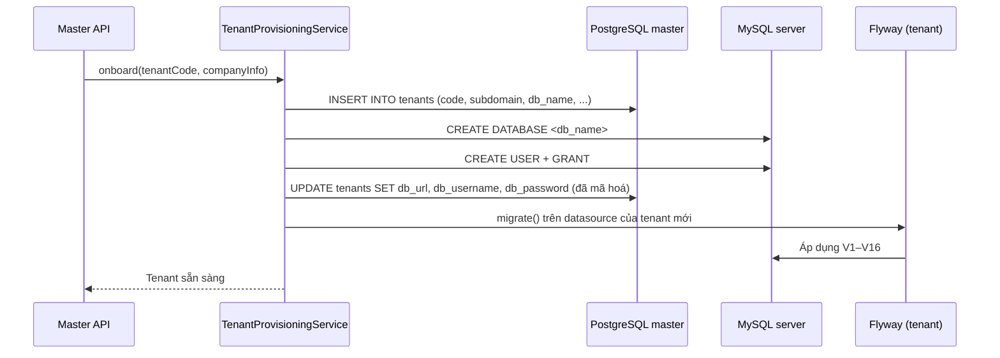

### 10.5 Quy tắc viết migration mới

1. **Không bao giờ sửa file migration đã được apply.** Luôn tạo version mới.
2. Đặt tên theo `V<n>__<mô_tả_snake_case>.sql`, tăng dần và không trùng trong từng pipeline; không lấp version đã dùng ở tenant khác.
3. Migration tenant phải chạy được trên **mọi** tenant đang tồn tại, kể cả tenant có dữ liệu cũ. Ưu tiên
   viết idempotent như `V5__cv_screening_pipeline.sql`.
4. MySQL 5.7 chỉ cho phép **một** cột `TIMESTAMP ... ON UPDATE CURRENT_TIMESTAMP` trên mỗi bảng.
5. Khi thêm cột `NOT NULL` vào bảng đã có dữ liệu, phải kèm `DEFAULT` hoặc câu lệnh backfill.
6. Khai báo khoá ngoại ngay trong cùng migration tạo cột — đừng lặp lại sai lầm của `cvs.application_id`.
7. Sau khi viết migration, **bắt buộc** cập nhật tài liệu này theo [`MAINTENANCE.md`](MAINTENANCE.md).

### 10.6 Kiểm chứng schema

```bash
# Master — Hibernate validate sẽ chặn ứng dụng khởi động nếu entity lệch schema
cd backend && ./mvnw spring-boot:run

# Đối chiếu số bảng thực tế
# PostgreSQL
psql -d smarthire_master -c "\dt"
# MySQL
mysql -e "SELECT COUNT(*) FROM information_schema.tables WHERE table_schema = '<db_name>';"

# Trạng thái migration
./mvnw flyway:info
```

Master DB chạy `hbm2ddl.auto = validate` nên mọi lệch pha giữa entity và schema sẽ làm ứng dụng **không khởi
động được**. Tenant DB chạy `none`, nên lệch pha ở tenant chỉ lộ ra khi truy vấn thật sự chạy — đây là lý do
tài liệu và migration tenant phải được rà soát kỹ hơn.

### 10.7 Kiểm tra và nâng cấp assessment

Ngày 2026-09-24, sau khi sao lưu và được người dùng chấp thuận, tenant `ttqt` đã nâng cấp
V11 → V12 thành công. Chạy lại không phát sinh migration; đủ `tests`, `questions`, `options`,
`submissions`, `answers`, đều chưa có bản ghi. `legacy_v12_assessments` và `legacy_v12_questions`
cũng rỗng. Lịch sử V9 analytics/V10/V11 được giữ nguyên. Chưa xác minh phiên đăng nhập UI thật
của tenant này sau khi khởi động lại backend.

Chạy từ `backend/` với Java 21+, Maven và thông tin provisioning trong `.env` (không in/commit secret):

```powershell
.\mvnw.cmd clean "-Dtest=AssessmentServiceTest,AssessmentFlowTest,TenantDataSourceFactoryTest,TenantInfrastructureTest" test
.\mvnw.cmd dependency:build-classpath "-Dmdep.outputFile=target/assessment-classpath.txt"
$cp = (Get-Content target/assessment-classpath.txt -Raw).Trim()
java --class-path $cp scripts/TenantMigrationCheck.java verify smarthire_tenant_assessment_verify_unique_name
java --class-path $cp scripts/TenantMigrationCheck.java inspect smarthire_tenant_ttqt
# Chỉ chạy khi đã sao lưu và được người quản trị chấp thuận:
java --class-path $cp scripts/TenantMigrationCheck.java migrate smarthire_tenant_ttqt
```

`verify` tạo database kiểm thử riêng, nâng cấp V11 → V12 với dữ liệu legacy mẫu, kiểm tra dữ liệu
còn nguyên và migrate lần hai không thay đổi. Script không tự drop database kiểm thử.
`clean` quan trọng sau khi đổi tên migration: tránh file V5/V6/V9 cũ còn trong `target/classes`.
Build sạch và khởi động lại backend trước khi thử lại UI; pool đang cache không tự chạy lại migration.

`AssessmentFlowTest` mặc định dùng H2. Để chạy service test trên schema Flyway/MySQL, truyền
`ASSESSMENT_TEST_JDBC_URL`, `ASSESSMENT_TEST_USER`, `ASSESSMENT_TEST_PASSWORD`; URL bắt buộc trỏ
database có tiền tố `smarthire_tenant_assessment_verify_`. Test không tạo/drop schema bằng Hibernate
khi dùng MySQL và chỉ thêm dữ liệu fixture trong database kiểm thử.

MySQL DDL không rollback cả file khi một statement lỗi. Nếu V12 thất bại, dừng sử dụng tenant,
kiểm tra schema/history và bản sao lưu; không chạy `repair` rồi retry một cách tự động.
