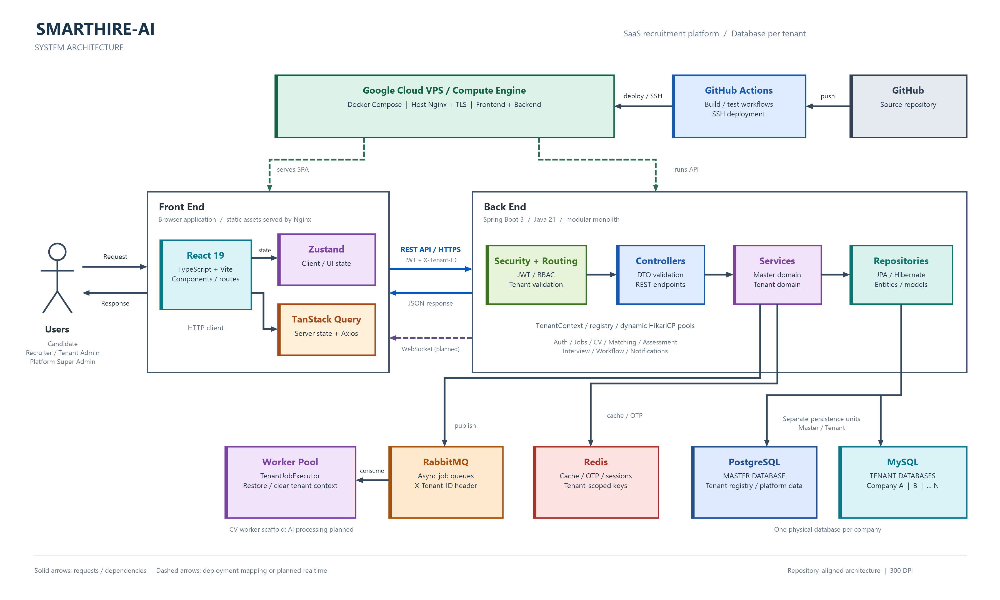

# System Architecture và Package Diagram

## Định danh và phạm vi

- Phạm vi: toàn bộ hệ thống SmartHire-AI.
- Sơ đồ 1: [System Architecture](system-architecture.png) mô tả triển khai, các lớp xử lý và hạ tầng của hệ thống.
- Sơ đồ 2: [Package Diagram](package-diagram.png) mô tả cấu trúc package frontend/backend và các quan hệ phụ thuộc chính.
- Nội dung dưới đây giải thích hai ảnh PNG hiện tại. Các file `.puml` là nguồn sơ đồ ban đầu; bố cục và mức chi tiết không hoàn toàn trùng với bản PNG đã thiết kế lại.
- Ngoài phạm vi: chi tiết class, bảng, endpoint và sequence của từng feature.

## Mục đích

Hai sơ đồ giúp nhóm phát triển nhìn rõ luồng từ người dùng qua Nginx, React và Spring Boot đến các kho dữ liệu; đồng thời thể hiện ranh giới bắt buộc giữa Master Domain, Tenant Domain và cơ chế database-per-tenant.

## Nguồn đã đối chiếu

- `AGENTS.md`, `DESIGN.md`, `README.md`.
- `docs/architecture/OVERVIEW.md`, `DOMAIN_MODEL.md`, `ASYNC_AND_CACHE.md`, `INFRA_CHECKLIST.md`.
- `docker-compose.yml`, `docker-compose.prod.yml`.
- Cấu trúc thực tế trong `frontend/src` và `backend/src/main/java/com/smarthire`.
- `MasterJpaConfig`, `MultiTenantJpaConfig`, `TenantWebInterceptor`, `TenantContext`, `DynamicMultiTenantConnectionProvider`, `TenantJobExecutor`, `JobPublisher` và `RabbitMqConfig`.
- Flyway migration trong `db/migration/master` và `db/migration/tenant`.

## Thành phần và actor

- Actor: Candidate, Recruiter/Tenant Admin và Platform Super Admin.
- Frontend: React SPA, route theo role, API client tách Master/Tenant và tự gắn `X-Tenant-ID` cho tenant API.
- Backend: REST, bảo mật JWT/RBAC, Master Domain, Tenant Domain, Multi-Tenant Core và worker RabbitMQ; WebSocket là phần dự kiến.
- Persistence: PostgreSQL cho Master DB; MySQL database riêng cho từng tenant; Redis cho dữ liệu ngắn hạn; RabbitMQ cho công việc bất đồng bộ.
- Ảnh PNG chỉ thể hiện các thành phần chính; AI provider, object storage, email gateway và Google OAuth không được vẽ thành các khối riêng trong ảnh này.

## Tiền điều kiện và hậu điều kiện kiến trúc

- Tenant request phải có tenant hợp lệ từ header, subdomain hoặc tenant claim đã xác thực.
- `TenantContext` phải được thiết lập trước mọi truy cập Tenant DB và được xóa sau request/job.
- Worker phải nhận `X-Tenant-ID`, xác nhận tenant còn hoạt động, chạy transaction sau khi đặt context và luôn xóa context trong `finally`.
- Master data và tenant data dùng entity manager, transaction manager và migration pipeline riêng.
- Kết quả là mỗi request hoặc job chỉ truy cập đúng một database tenant; không tồn tại association hoặc query trực tiếp xuyên tenant.

## Giải thích System Architecture

### Người dùng và triển khai

| Thành phần trong ảnh | Chức năng |
| --- | --- |
| **Users — Candidate** | Ứng viên sử dụng giao diện tìm việc, hồ sơ/CV, ứng tuyển, đánh giá và phỏng vấn theo phạm vi tính năng được triển khai. |
| **Users — Recruiter / Tenant Admin** | Nhà tuyển dụng xử lý nghiệp vụ tuyển dụng; quản trị viên doanh nghiệp quản lý người dùng và cấu hình trong tenant của mình. |
| **Users — Platform Super Admin** | Quản trị nền tảng SaaS, quản lý tenant và các chức năng cấp Master; khác với quản trị viên của một doanh nghiệp. |
| **GitHub** | Lưu mã nguồn và lịch sử thay đổi. Sự kiện push hoặc thao tác chạy workflow thủ công có thể kích hoạt GitHub Actions theo cấu hình workflow. |
| **GitHub Actions** | Chạy các workflow kiểm tra/build và triển khai. Workflow triển khai dùng SSH để chạy quy trình deploy trên VPS; các workflow không mặc nhiên là một chuỗi build → test → deploy có ràng buộc đầy đủ. |
| **Google Cloud VPS / Compute Engine** | Máy chủ chạy ứng dụng và các dịch vụ hạ tầng theo cấu hình production. Frontend và backend được triển khai trên cùng môi trường VPS trong sơ đồ. |
| **Docker Compose** | Định nghĩa, khởi chạy và kết nối các container frontend, backend, PostgreSQL, MySQL, Redis và RabbitMQ. |
| **Host Nginx + TLS** | Nginx trên host tiếp nhận HTTPS và kết thúc TLS, sau đó chuyển tiếp đến Nginx trong frontend container. Nginx của frontend phục vụ SPA và proxy `/api/` đến backend. |

### Front End và giao tiếp API

| Thành phần trong ảnh | Chức năng |
| --- | --- |
| **Front End** | Ứng dụng chạy trên trình duyệt, hiển thị giao diện và gọi backend. Khung này gom các thư viện phía client, không đại diện cho các server riêng biệt. |
| **React 19** | Xây dựng giao diện từ component; phối hợp router để hiển thị trang theo đường dẫn và vai trò người dùng. |
| **TypeScript + Vite** | TypeScript kiểm tra kiểu dữ liệu trong mã frontend; Vite phục vụ môi trường phát triển và đóng gói tài nguyên SPA để triển khai. |
| **Zustand** | Quản lý trạng thái phía client, như trạng thái giao diện hoặc thông tin phiên mà ứng dụng cần dùng chung. |
| **TanStack Query** | Quản lý dữ liệu lấy từ server: truy vấn, cache phía client, trạng thái loading/error và cập nhật lại dữ liệu. Cache này khác với Redis trên server. |
| **Axios / HTTP client** | Gửi HTTP request và nhận response. Tenant client gắn token và `X-Tenant-ID`; Master client có cấu hình token riêng. |
| **REST API / HTTPS** | Kênh gọi API giữa frontend và backend qua HTTPS ở biên triển khai. Nginx proxy request đến Spring Boot; mũi tên không có nghĩa mọi kết nối nội bộ Docker đều dùng TLS. |
| **JWT** | Token xác thực được gửi qua header `Authorization`; backend kiểm tra token và quyền trước khi xử lý tài nguyên được bảo vệ. |
| **X-Tenant-ID** | Header xác định doanh nghiệp cần truy cập. Backend đối chiếu tenant với registry và phiên xác thực, không tin trực tiếp giá trị frontend gửi lên. |
| **JSON response** | Dữ liệu hoặc thông tin lỗi backend trả cho frontend để cập nhật giao diện. |
| **WebSocket (planned)** | Kênh thông báo realtime dự kiến, ví dụ báo hoàn tất tác vụ. Đường nét đứt và chữ `planned` thể hiện phần chưa triển khai đầy đủ, không phải tính năng đã vận hành. |

### Back End và các lớp xử lý

| Thành phần trong ảnh | Chức năng |
| --- | --- |
| **Back End — Spring Boot 3 / Java 21** | Ứng dụng server tiếp nhận API, kiểm tra quyền, thực hiện nghiệp vụ và truy cập dữ liệu. Kiến trúc modular monolith gom các module trong một ứng dụng; các khối bên trong không phải microservice độc lập. |
| **Security + Routing** | Xác thực JWT, áp dụng RBAC, định tuyến request và kiểm tra tenant. Đây là nhóm trách nhiệm tổng hợp của filter, cấu hình security, routing và interceptor. |
| **Controllers** | Tiếp nhận endpoint REST, kiểm tra DTO đầu vào, gọi service và trả response. Controller không chứa nghiệp vụ chính. |
| **Services** | Thực hiện quy tắc nghiệp vụ và điều phối repository, cache hoặc tác vụ bất đồng bộ khi chức năng có sử dụng. |
| **Master domain** | Nghiệp vụ cấp nền tảng: quản trị tenant, tài khoản quản trị nền tảng, gói dịch vụ và thông tin SaaS. |
| **Tenant domain** | Nghiệp vụ thuộc doanh nghiệp: auth, jobs, CV, matching, assessment, interview, workflow và notifications. Sự hiện diện của module không đồng nghĩa toàn bộ nghiệp vụ đã hoàn tất. |
| **Repositories** | Cung cấp thao tác truy vấn/lưu dữ liệu thông qua lớp persistence. Service sử dụng repository thay vì để controller thao tác database trực tiếp. |
| **JPA / Hibernate** | Ánh xạ entity với dữ liệu quan hệ và quản lý truy cập persistence; cấu hình tenant chọn kết nối phù hợp theo tenant hiện tại. |
| **Entities / models** | Biểu diễn dữ liệu lưu trữ trong backend; không trả trực tiếp entity ra API thay cho DTO. |
| **TenantContext** | Lưu tenant hiện tại trên luồng xử lý để chọn đúng Tenant DB. Context phải được đặt trước khi mở phiên xử lý tenant và được xóa sau request/job. |
| **Registry** | Tra cứu tenant, trạng thái hoạt động và thông tin kết nối trong Master DB. Giúp từ chối tenant không hợp lệ hoặc không hoạt động. |
| **Dynamic HikariCP pools** | Quản lý pool kết nối động cho từng tenant. Mỗi pool trỏ đến database doanh nghiệp tương ứng. |

### Dữ liệu và tác vụ bất đồng bộ

| Thành phần trong ảnh | Chức năng |
| --- | --- |
| **PostgreSQL — Master Database** | Lưu dữ liệu nền tảng và registry tenant, bao gồm thông tin kết nối tenant đã mã hóa. Không phải nơi gom toàn bộ dữ liệu tuyển dụng của các doanh nghiệp. |
| **MySQL — Tenant Databases** | Lưu dữ liệu tuyển dụng riêng cho từng doanh nghiệp. `Company A / B / ... N` biểu thị nhiều database vật lý riêng, có thể cùng nằm trên một MySQL server. |
| **Separate persistence units — Master / Tenant** | Master và Tenant dùng entity manager và transaction manager riêng. Request nghiệp vụ có thể tra registry Master trước rồi xử lý một Tenant DB; không phải truy vấn xuyên các Tenant DB. |
| **Redis** | Hạ tầng cho cache, OTP, session và dữ liệu ngắn hạn theo chức năng. Dữ liệu thuộc tenant cần key có phạm vi tenant để tránh va chạm; ảnh mô tả trách nhiệm kiến trúc, không xác nhận mọi use case Redis đã được triển khai. |
| **RabbitMQ** | Lưu chuyển công việc bất đồng bộ để backend không phải thực hiện toàn bộ tác vụ lâu ngay trong request. Job tenant mang header `X-Tenant-ID`. |
| **Worker Pool** | Nhóm consumer xử lý công việc từ RabbitMQ trong backend. Khối riêng trên ảnh thể hiện vai trò xử lý, không khẳng định có container worker độc lập. |
| **TenantJobExecutor** | Wrapper xác nhận tenant đang hoạt động, phục hồi `TenantContext`, chạy callback xử lý và luôn xóa context trong `finally`. Tenant thiếu/không hoạt động bị reject và không requeue. |
| **CV worker scaffold; AI processing planned** | Consumer CV đã có khung xử lý tenant-aware; phần xử lý AI vẫn chưa hoàn thiện. Không suy ra worker đã phân tích CV hoặc chấm điểm AI đầy đủ. |

### Ý nghĩa các đường nối

| Đường nối / nhãn | Ý nghĩa |
| --- | --- |
| **Users → Front End: Request; Front End → Users: Response** | Người dùng thao tác trên giao diện và nhận kết quả hiển thị; đây là tương tác người dùng ở mức khái quát. |
| **GitHub → GitHub Actions: push** | Thay đổi mã nguồn có thể kích hoạt workflow theo bộ lọc sự kiện đã cấu hình. |
| **GitHub Actions → VPS: deploy / SSH** | Workflow kết nối SSH đến VPS để thực hiện deploy. |
| **VPS ⇢ Front End / Back End: serves SPA / runs API** | Nét đứt mô tả ánh xạ triển khai: VPS phục vụ frontend và chạy backend; không phải API nghiệp vụ. |
| **React → Zustand: state** | Component sử dụng và cập nhật trạng thái phía client. |
| **React → TanStack Query** | Component lấy dữ liệu server thông qua query và HTTP client. |
| **Front End → Back End: REST API; Back End → Front End: JSON response** | Cặp request/response đồng bộ. Token và tenant header được kiểm tra phía backend. |
| **Back End ⇢ Front End: WebSocket (planned)** | Thông báo realtime dự kiến; khác với JSON response trả cho một request REST. |
| **Security + Routing → Controllers → Services → Repositories** | Trình tự trách nhiệm xử lý chính, không liệt kê từng lời gọi hàm hoặc mọi nhánh thực thi. |
| **Repositories → PostgreSQL / MySQL** | Hai nhánh persistence khác nhau: dữ liệu nền tảng đi vào Master DB, dữ liệu doanh nghiệp vào đúng Tenant DB. Không phải mọi request đều ghi cả hai. |
| **Services → Redis: cache / OTP** | Service dùng dữ liệu ngắn hạn hoặc cache khi cần. |
| **Services → RabbitMQ: publish** | Service phát hành công việc bất đồng bộ khi nghiệp vụ có dùng messaging; nhiều module hiện vẫn là scaffold. |
| **RabbitMQ → Worker Pool: consume** | Consumer nhận job và xử lý trong tenant context hợp lệ. Sơ đồ không vẽ hết các lời gọi từ worker về service/persistence. |

Nền màu giúp phân biệt thành phần: deployment xanh lá, các lớp ứng dụng xanh/tím, database xanh, Redis đỏ và RabbitMQ cam. Màu chỉ hỗ trợ đọc sơ đồ; nhãn và mũi tên quyết định ý nghĩa kỹ thuật. Nét liền là tương tác/phụ thuộc, nét đứt là ánh xạ triển khai hoặc realtime dự kiến theo nhãn đi kèm.

## Giải thích Package Diagram

Frontend được chia thành application shell, feature Master/Tenant, API client, component dùng chung, state/hook, thư viện và tài nguyên hỗ trợ. Backend giữ các bounded context nghiệp vụ trong `master` và `tenant`; entity/repository nằm ở `domain`; `multitenancy` chịu trách nhiệm định tuyến database; `messaging`, `security`, `config` và `common` là các package hạ tầng/cross-cutting. Mũi tên chỉ dependency quan trọng, không nhằm liệt kê mọi import.

### ***Package Descriptions***

Các tên có dấu `/` là đường dẫn frontend; tên có dấu `.` là package Java. Những ô ghép nhiều tên trong ảnh được tách thành từng dòng để giải thích rõ. Tên package Java dưới đây được hiểu là nằm trong `com.smarthire`.

| **No** | **Package** | **Description** |
| ------ | ----------- | --------------- |
| 01 | `frontend/src` | Thư mục gốc mã nguồn frontend; chứa application shell, feature, API client và tài nguyên dùng chung. |
| 02 | `app` | Khởi tạo ứng dụng, provider, router, layout và route guard theo vai trò/ngữ cảnh Master hoặc Tenant. |
| 03 | `features/master` | Giao diện cấp nền tảng: auth, dashboard, landing và onboarding doanh nghiệp. |
| 04 | `features/tenant` | Giao diện của doanh nghiệp: auth, admin, career, candidate và recruiter; gom các trang tuyển dụng theo vai trò. |
| 05 | `api/master` | Module gọi API cấp nền tảng; `client.ts` tạo Axios client riêng và gắn token Master. |
| 06 | `api/tenant` | Module gọi API tuyển dụng, như job, CV, assessment và matching; sử dụng tenant HTTP client từ `lib`. |
| 07 | `components` | Component tái sử dụng: `ui` chứa primitive giao diện, `shared` chứa component dùng chung, `ux` chứa hỗ trợ trải nghiệm. |
| 08 | `lib` | Tiện ích dùng chung; `axios.ts` quản lý tenant HTTP client, `tenant.ts` xác định tenant, `utils.ts` cung cấp hàm hỗ trợ. |
| 09 | `hooks` | Custom React hooks dùng chung để tái sử dụng logic và tích hợp với trạng thái/ngữ cảnh ứng dụng. |
| 10 | `stores` | Kho trạng thái dùng chung phía client theo Zustand; không thay thế TanStack Query để chứa toàn bộ dữ liệu server. |
| 11 | `styles` | CSS và design tokens dùng cho màu sắc, typography và giao diện nhất quán. |
| 12 | `i18n` | Cấu hình đa ngôn ngữ và các bộ bản dịch trong `locales`. |
| 13 | `types` | Kiểu TypeScript dùng chung, bao gồm cấu trúc dữ liệu và response API được dùng giữa các module. |
| 14 | `com.smarthire` | Package gốc backend; chứa các module nghiệp vụ, persistence, bảo mật, cấu hình và hạ tầng. |
| 15 | `master` | Nghiệp vụ cấp SaaS: `admin` quản trị/xác thực nền tảng, `tenant` quản lý doanh nghiệp, `subscription` quản lý gói dịch vụ, `analytics` thống kê nền tảng. |
| 16 | `tenant` | Nghiệp vụ doanh nghiệp: `auth` xác thực/người dùng; `job` tin tuyển dụng; `applicant` hồ sơ ứng tuyển; `cv` xử lý CV; `matching` chấm điểm/xếp hạng; `assessment` bài đánh giá; `interview` phỏng vấn; `practice` luyện tập; `workflow` pipeline; `schedule` lịch; `notification` thông báo; `dashboard` tổng quan. Một số module còn ở mức scaffold. |
| 17 | `domain.master` | `entity` và `repository` của Master DB; lưu/truy vấn dữ liệu nền tảng và registry tenant qua persistence unit Master. |
| 18 | `domain.tenant` | `entity` và `repository` của Tenant DB; lưu/truy vấn dữ liệu tuyển dụng qua persistence unit Tenant, với database được chọn theo context. |
| 19 | `multitenancy` | Cơ chế cách ly doanh nghiệp: `context` giữ tenant hiện tại; `interceptor` kiểm tra tenant request; `resolver` cung cấp identifier cho Hibernate; `datasource` quản lý pool; `service` tra registry, xử lý credential và provisioning. |
| 20 | `messaging` | Phát hành/tiêu thụ RabbitMQ job: `JobPublisher` gắn tenant header, `CvAnalysisWorker` nhận job CV, `TenantJobExecutor` bảo đảm context hợp lệ và được dọn sau xử lý. Các tên này là class trong package, không phải package con. |
| 21 | `config` | Cấu hình Spring cho JPA Master/Tenant, Security, MVC, Redis, RabbitMQ, CORS và OpenAPI; liên kết các thành phần hạ tầng. |
| 22 | `security` | Xử lý JWT, xác thực request và principal; phối hợp cấu hình security và tenant context để bảo vệ API. |
| 23 | `common` | Thành phần dùng chung: `api` chứa response contract, `exception` chứa lỗi/handler, `redis` chứa tiện ích và quy ước key Redis. |
| 24 | `domain.enums` | Các enum nghiệp vụ dùng chung, biểu diễn tập giá trị hữu hạn như vai trò và trạng thái. |

### Cách đọc quan hệ package

- Khung ngoài `frontend/src` và `com.smarthire` biểu thị phạm vi chứa package; các ô có tab là ký hiệu package. Các dòng tên bên trong ô là package con hoặc thành phần tiêu biểu theo bảng mô tả.
- Mũi tên nét đứt đi từ package sử dụng đến package được sử dụng: `app` dùng feature, feature dùng API client, `api/tenant` dùng `lib`, `master` dùng `domain.master`, `tenant` dùng `domain.tenant` và `multitenancy`.
- Mũi tên nét liền `platform API` và `tenant API` biểu thị lời gọi HTTP từ frontend đến backend, không phải import Java/TypeScript xuyên ứng dụng.
- `multitenancy → domain.master` là phụ thuộc để tra registry; `messaging → multitenancy` phục vụ kiểm tra và phục hồi tenant context.
- Các package shared/configuration vẫn được sử dụng dù không vẽ tất cả mũi tên. Sơ đồ chọn các phụ thuộc chính để giữ độ rõ; không phải đồ thị import đầy đủ và không thể dùng để khẳng định hệ thống không có phụ thuộc ngược.

## Quyết định bảo mật, giao dịch và vận hành

- Ranh giới tenant được thực thi phía server, không tin riêng giá trị từ frontend.
- Thông tin kết nối tenant thuộc Master DB và được lưu dưới dạng mã hóa theo contract hiện tại.
- Tenant pool là HikariCP động; không biểu diễn kết nối trực tiếp từ business package đến database khác tenant.
- RabbitMQ mang tenant identifier trong header; job thiếu tenant hoặc tenant không hoạt động bị reject và không requeue.
- Không đưa token, mật khẩu, nội dung CV hoặc PII vào sơ đồ.
- Sơ đồ chỉ thể hiện transaction boundary ở mức kiến trúc; transaction chi tiết thuộc sequence diagram của từng chức năng.

## Giả định và điểm chưa chốt

- Production topology bám theo `docker-compose.prod.yml`: host Nginx đứng trước frontend container, frontend proxy API đến backend trong Docker network.
- PostgreSQL là Master DB và MySQL là Tenant DB theo code/config hiện tại. Một số tài liệu tổng quan cũ vẫn ghi chung là MySQL và cần được hiểu theo nguồn triển khai mới hơn.
- AI provider, object storage và email gateway chưa có contract triển khai đầy đủ; chúng có trong nguồn PlantUML ban đầu nhưng không xuất hiện thành khối riêng trong ảnh PNG hiện tại.
- WebSocket có trong kiến trúc mục tiêu; package triển khai cụ thể chưa xuất hiện đầy đủ trong cây source hiện tại.

## Ảnh đã xuất và kiểm tra

| File | Kích thước | Ghi chú |
| --- | --- | --- |
| [system-architecture.png](system-architecture.png) | 3600 × 2160 px; ít nhất 300 DPI | Nền màu phân biệt thành phần; khung và đường nối đã tăng độ đậm. |
| [package-diagram.png](package-diagram.png) | 3600 × 2400 px; ít nhất 300 DPI | Nền trắng, khung package mảnh và các phụ thuộc được chọn lọc. |

Hai ảnh được dựng bằng System.Drawing từ script PowerShell và đã kiểm tra trực quan cùng metadata DPI. Chỉ xuất PNG theo yêu cầu; không tạo SVG. Nguồn PlantUML ban đầu chưa được validate bằng PlantUML vì môi trường không có renderer tương ứng; render lại `.puml` sẽ không tái tạo chính xác bố cục PNG hiện tại.

## Trạng thái review

`Complete with assumptions` — đã xuất PNG và giải thích các thành phần; các phần dự kiến/scaffold và khác biệt giữa nguồn PlantUML với PNG được ghi rõ ở trên.
